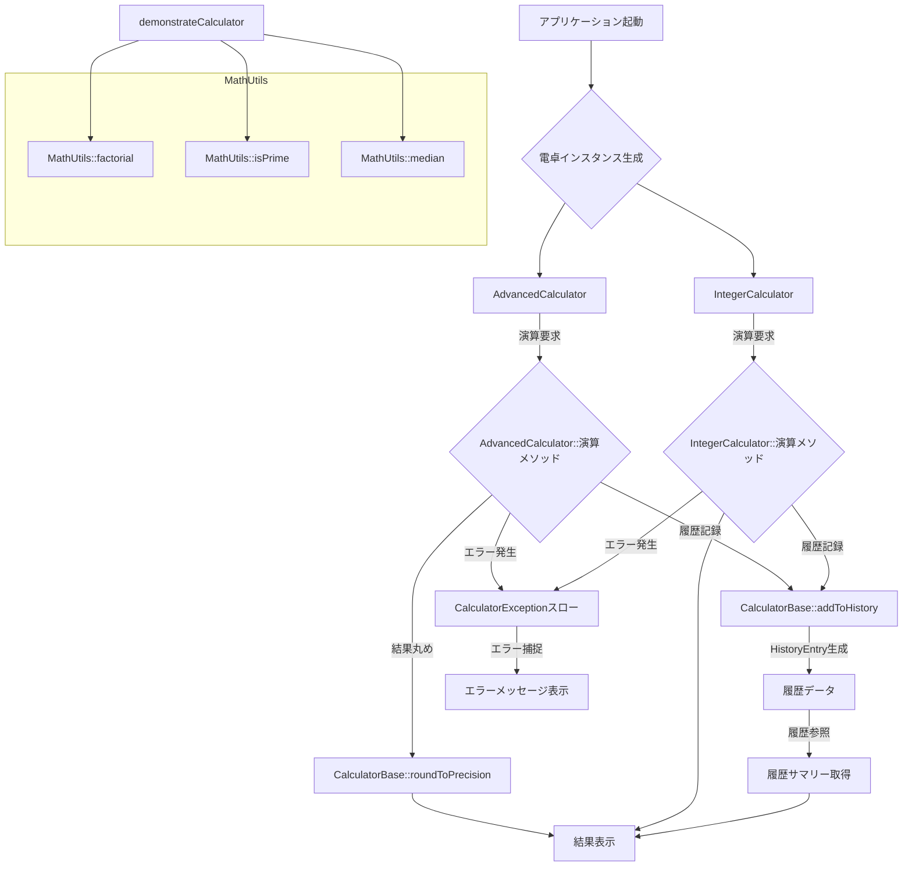
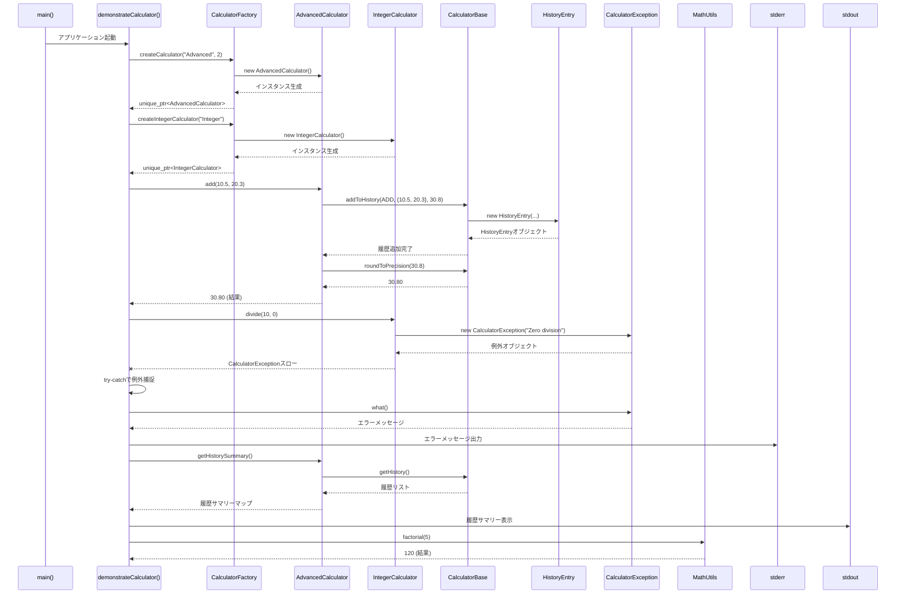

# calculator 詳細設計書

## 1. 概要

### システム概要
本システムは、数値計算機能を提供する単一モジュールで構成された電卓アプリケーションです。高度な浮動小数点数演算、整数演算、および汎用的な数学ユーティリティを提供し、計算履歴の管理機能も備えています。各コンポーネントは明確な責務を持ち、適切に分離された設計となっています。

### 対象範囲（ファイル）
本設計書は、以下の機能を提供する単一のC++モジュール（例: `calculator.h`, `calculator.cpp`）を対象とします。
*   電卓の基底機能と履歴管理
*   高度な浮動小数点数電卓機能
*   整数専用電卓機能
*   汎用数学ユーティリティ
*   電卓オブジェクト生成ファクトリ
*   カスタム例外処理
*   デモンストレーション機能

### 前提条件・制約事項
*   開発言語: C++11以降の標準C++
*   メモリ管理: `std::unique_ptr` を用いたRAIIによる安全なリソース管理
*   エラーハンドリング: カスタム例外クラス `CalculatorException` を用いた例外処理
*   入出力: 標準入出力（`std::cout`, `std::cerr`）を使用
*   数値型: テンプレートにより様々な数値型に対応可能（`double`, `int` など）

## 2. アーキテクチャ設計

### システム構成図
```mermaid
classDiagram
    direction LR
    class CalculatorBase<T> {
        <<abstract>>
        +string name
        +int precision
        +vector<HistoryEntry<T>> history
        +bool historyEnabled
        +CalculatorBase(name, precision, historyEnabled)
        +virtual ~CalculatorBase()
        +virtual T add(T, T)
        +virtual T subtract(T, T)
        +virtual T multiply(T, T)
        +virtual T divide(T, T)
        +string getName()
        +int getPrecision()
        +vector<HistoryEntry<T>> getHistory()
        +void clearHistory()
        +void setHistoryEnabled(bool)
        #void addToHistory(OperationType, vector<T>, T)
        #T roundToPrecision(T)
    }

    class AdvancedCalculator<T> {
        +AdvancedCalculator(name, precision)
        +T add(T, T)
        +T subtract(T, T)
        +T multiply(T, T)
        +T divide(T, T)
        +T square(T)
        +T power(T, T)
        +T sqrt(T)
        +T average(vector<T>)
        +T operator()(OperationType, vector<T>)
        +vector<T> applyFunction(vector<T>, function<T(T)>)
        +map<OperationType, int> getHistorySummary()
    }

    class IntegerCalculator {
        +IntegerCalculator(name)
        +int add(int, int)
        +int subtract(int, int)
        +int multiply(int, int)
        +int divide(int, int)
        +int modulo(int, int)
        +int gcd(int, int)
        +int lcm(int, int)
    }

    class HistoryEntry<T> {
        +OperationType operation
        +vector<T> operands
        +T result
        +chrono::system_clock::time_point timestamp
        +HistoryEntry(op, ops, res, ts)
        +OperationType getOperation()
        +vector<T> getOperands()
        +T getResult()
        +chrono::system_clock::time_point getTimestamp()
        +string toString()
        +string getOperationName()
    }

    class CalculatorException {
        +CalculatorException(message)
        +const char* what()
    }

    class MathUtils {
        +static T factorial(T)
        +static bool isPrime(int)
        +static vector<int> fibonacciSequence(int)
        +static T median(vector<T>)
    }

    class CalculatorFactory {
        +static unique_ptr<AdvancedCalculator<T>> createCalculator(string, int)
        +static unique_ptr<IntegerCalculator> createIntegerCalculator(string)
    }

    enum OperationType {
        ADD, SUBTRACT, MULTIPLY, DIVIDE, SQUARE, POWER, SQRT, AVERAGE,
        MODULO, GCD, LCM, FACTORIAL, IS_PRIME, FIBONACCI, MEDIAN
    }

    CalculatorBase <|-- AdvancedCalculator : inherits
    CalculatorBase <|-- IntegerCalculator : inherits
    CalculatorBase *-- HistoryEntry : aggregates
    AdvancedCalculator ..> OperationType : uses
    IntegerCalculator ..> OperationType : uses
    HistoryEntry ..> OperationType : uses
    CalculatorFactory ..> AdvancedCalculator : creates
    CalculatorFactory ..> IntegerCalculator : creates
    CalculatorBase ..> CalculatorException : throws
    AdvancedCalculator ..> CalculatorException : throws
    IntegerCalculator ..> CalculatorException : throws
    MathUtils ..> CalculatorException : throws
```

### 処理フロー概要
アプリケーションのエントリポイントである`main`関数から、電卓機能のデモンストレーションを行う`demonstrateCalculator`関数が呼び出されます。`demonstrateCalculator`関数は、`CalculatorFactory`を利用して`AdvancedCalculator`と`IntegerCalculator`のインスタンスを生成します。生成された電卓インスタンスは、様々な計算を実行し、その結果を標準出力に表示します。計算中にエラーが発生した場合は、`CalculatorException`がスローされ、適切に捕捉・処理されます。各計算結果は`HistoryEntry`として電卓内部の履歴に記録されます。

### 主要コンポーネント間の関係
*   **`CalculatorBase<T>`**: 電卓機能の共通インターフェースと基盤を提供します。履歴管理や精度丸めなどの共通処理をカプセル化し、`AdvancedCalculator`と`IntegerCalculator`の抽象基底クラスとして機能します。
*   **`AdvancedCalculator<T>`**: `CalculatorBase`を継承し、浮動小数点数に特化した高度な計算機能（べき乗、平方根、平均など）を提供します。履歴記録と精度丸めを自動的に行います。
*   **`IntegerCalculator`**: `CalculatorBase`を継承し、整数に特化した計算機能（剰余、最大公約数、最小公倍数など）を提供します。
*   **`HistoryEntry<T>`**: 個々の計算履歴エントリのデータ構造を定義します。`CalculatorBase`によって管理されます。
*   **`CalculatorException`**: 計算処理中に発生するエラー（ゼロ除算、負数の平方根など）を示すカスタム例外クラスです。
*   **`MathUtils`**: 電卓オブジェクトに依存しない汎用的な数学ユーティリティ機能（階乗、素数判定、フィボナッチ数列、中央値など）を提供します。静的メソッドとして提供され、直接呼び出されます。
*   **`CalculatorFactory`**: 電卓オブジェクト（`AdvancedCalculator`, `IntegerCalculator`）の生成を一元的に管理するファクトリクラスです。`std::unique_ptr`を使用して、生成されたオブジェクトの所有権を安全に転送します。

### 関連するファイルや処理・呼び出されるメソッド・呼び出し元のメソッド
| ファイル/処理 | 呼び出し元 | 呼び出されるメソッド/クラス | 備考 |
| :------------ | :--------- | :-------------------------- | :--- |
| `main`        | OS         | `demonstrateCalculator()`   | アプリケーション起動 |
| `demonstrateCalculator` | `main`     | `CalculatorFactory::createCalculator()` | 電卓インスタンス生成 |
|               |            | `CalculatorFactory::createIntegerCalculator()` | |
|               |            | `AdvancedCalculator<T>::add()`, `subtract()`... | 浮動小数点数演算実行 |
|               |            | `IntegerCalculator::add()`, `modulo()`... | 整数演算実行 |
| `AdvancedCalculator<T>` | 各演算メソッド | `CalculatorBase::addToHistory()` | 履歴記録 |
|               |            | `CalculatorBase::roundToPrecision()` | 結果丸め |
|               |            | `CalculatorException` (スロー) | エラー発生時 |
| `IntegerCalculator` | 各演算メソッド | `CalculatorBase::addToHistory()` | 履歴記録 |
|               |            | `CalculatorException` (スロー) | エラー発生時 |
| `CalculatorFactory` | `demonstrateCalculator` | `std::make_unique<AdvancedCalculator<T>>()` | `unique_ptr`で生成 |
|               |            | `std::make_unique<IntegerCalculator>()` | |
| `MathUtils`   | `demonstrateCalculator` | `MathUtils::factorial()`, `isPrime()`... | 静的メソッド呼び出し |
| `CalculatorException` | 各演算メソッド | `std::runtime_error` (継承) | 例外メッセージ設定 |

## 3. クラス・メソッド設計

### 3.1 クラス・メソッド一覧表

| クラス名 | 役割 | 主要メソッド | 備考 |
| :-------------------- | :--------------------------------- | :-------------------------- | :------------------- |
| `CalculatorBase<T>`   | 電卓の共通基盤と履歴管理 | `add, subtract, getName...` | 抽象基底クラス |
| `AdvancedCalculator<T>` | 高度な浮動小数点数計算 | `add, subtract, square...` | テンプレートクラス |
| `IntegerCalculator`   | 整数演算に特化した電卓 | `add, subtract, modulo...` | `int`型専用 |
| `HistoryEntry<T>`     | 計算履歴の単一エントリ | `getOperation, getResult, toString...` | データ構造 |
| `CalculatorException` | 計算処理のエラー例外 | `CalculatorException, what` | カスタム例外 |
| `MathUtils`           | 一般的な数学ユーティリティ | `factorial, isPrime, median...` | 静的メソッド中心 |
| `CalculatorFactory`   | 電卓オブジェクトの生成 | `createCalculator, createIntegerCalculator` | ファクトリパターン |

### 3.2 クラス・メソッド詳細仕様

#### 3.2.1 クラス: `CalculatorBase<T>`

*   **クラス概要**:
    電卓機能の共通基盤を提供する抽象基底クラスです。電卓の名前、計算精度、履歴記録の有効/無効設定、および履歴管理機能を提供します。具体的な演算処理は純粋仮想関数として定義され、派生クラスで実装されます。

*   **属性一覧**:
    | 属性名 | 型 | 初期値 | 説明 |
    | :----- | :--- | :----- | :--- |
    | `name_` | `std::string` | コンストラクタ引数 | 電卓の名前 |
    | `precision_` | `int` | コンストラクタ引数 | 計算結果の丸め精度（小数点以下の桁数） |
    | `history_` | `std::vector<HistoryEntry<T>>` | 空 | 実行された計算履歴のリスト |
    | `historyEnabled_` | `bool` | コンストラクタ引数 | 履歴記録の有効/無効フラグ |

*   **メソッド仕様**:
    *   **`CalculatorBase(std::string name, int precision, bool historyEnabled)`**
        *   引数: `name` (電卓名), `precision` (精度), `historyEnabled` (履歴有効フラグ)
        *   戻り値: なし (コンストラクタ)
        *   処理概要: 電卓の基本属性を初期化します。
        *   例外: なし
    *   **`virtual ~CalculatorBase()`**
        *   引数: なし
        *   戻り値: なし (デストラクタ)
        *   処理概要: オブジェクトのリソースを解放します。
        *   例外: なし
    *   **`virtual T add(T a, T b) = 0`**
        *   引数: `a` (オペランド1), `b` (オペランド2)
        *   戻り値: `T` (加算結果)
        *   処理概要: 2つの値を加算します。純粋仮想関数であり、派生クラスでの実装が必須です。
        *   例外: なし (実装依存)
    *   **`std::string getName()`**
        *   引数: なし
        *   戻り値: `std::string` (電卓の名前)
        *   処理概要: 電卓の名前を返します。
        *   例外: なし
    *   **`void addToHistory(OperationType op, const std::vector<T>& operands, T result)` (protected)**
        *   引数: `op` (操作タイプ), `operands` (オペランドのリスト), `result` (計算結果)
        *   戻り値: `void`
        *   処理概要: `historyEnabled_`が`true`の場合、新しい`HistoryEntry`を作成し`history_`に追加します。
        *   例外: なし
    *   **`T roundToPrecision(T value)` (protected)**
        *   引数: `value` (丸める値)
        *   戻り値: `T` (丸められた値)
        *   処理概要: `precision_`に基づいて`value`を丸めます。
        *   例外: なし

*   **継承・実装関係**:
    *   `AdvancedCalculator<T>` および `IntegerCalculator` の基底クラスです。
    *   `HistoryEntry<T>` を集約します。

#### 3.2.2 クラス: `AdvancedCalculator<T>`

*   **クラス概要**:
    `CalculatorBase`を継承し、浮動小数点数に特化した高度な数学演算機能を提供します。加減乗除に加え、2乗、べき乗、平方根、平均などの機能を提供し、全ての演算結果は自動的に履歴に記録され、指定された精度で丸められます。

*   **属性一覧**: なし (基底クラスの属性を利用)

*   **メソッド仕様**:
    *   **`AdvancedCalculator(std::string name, int precision)`**
        *   引数: `name` (電卓名), `precision` (精度)
        *   戻り値: なし (コンストラクタ)
        *   処理概要: `CalculatorBase`のコンストラクタを呼び出し、高度な電卓を初期化します。
        *   例外: なし
    *   **`T add(T a, T b)`**
        *   引数: `a` (オペランド1), `b` (オペランド2)
        *   戻り値: `T` (加算結果)
        *   処理概要: `a`と`b`を加算し、結果を丸めて履歴に記録します。
        *   例外: なし
    *   **`T divide(T a, T b)`**
        *   引数: `a` (被除数), `b` (除数)
        *   戻り値: `T` (除算結果)
        *   処理概要: `a`を`b`で除算し、結果を丸めて履歴に記録します。`b`が0の場合は`CalculatorException`をスローします。
        *   例外: `CalculatorException` (ゼロ除算時)
    *   **`T sqrt(T value)`**
        *   引数: `value` (平方根を計算する値)
        *   戻り値: `T` (平方根の結果)
        *   処理概要: `value`の平方根を計算し、結果を丸めて履歴に記録します。`value`が負の場合は`CalculatorException`をスローします。
        *   例外: `CalculatorException` (負の数の平方根時)
    *   **`std::map<OperationType, int> getHistorySummary()`**
        *   引数: なし
        *   戻り値: `std::map<OperationType, int>` (操作タイプごとの実行回数)
        *   処理概要: 履歴から各操作タイプの実行回数を集計し、マップとして返します。
        *   例外: なし

*   **継承・実装関係**:
    *   `CalculatorBase<T>` を継承します。

#### 3.2.3 クラス: `IntegerCalculator`

*   **クラス概要**:
    `CalculatorBase<int>`を継承し、整数演算に特化した機能を提供します。加減乗除に加え、剰余、最大公約数、最小公倍数などの整数固有の演算をサポートします。

*   **属性一覧**: なし (基底クラスの属性を利用)

*   **メソッド仕様**:
    *   **`IntegerCalculator(std::string name)`**
        *   引数: `name` (電卓名)
        *   戻り値: なし (コンストラクタ)
        *   処理概要: `CalculatorBase<int>`のコンストラクタを呼び出し、整数電卓を初期化します。精度は0に設定されます。
        *   例外: なし
    *   **`int modulo(int a, int b)`**
        *   引数: `a` (被除数), `b` (除数)
        *   戻り値: `int` (剰余)
        *   処理概要: `a`を`b`で除算した剰余を計算し、履歴に記録します。`b`が0の場合は`CalculatorException`をスローします。
        *   例外: `CalculatorException` (ゼロ除算時)
    *   **`int gcd(int a, int b)`**
        *   引数: `a` (数値1), `b` (数値2)
        *   戻り値: `int` (最大公約数)
        *   処理概要: 2つの整数の最大公約数を計算し、履歴に記録します。ユークリッドの互除法を使用します。
        *   例外: なし
    *   **`int lcm(int a, int b)`**
        *   引数: `a` (数値1), `b` (数値2)
        *   戻り値: `int` (最小公倍数)
        *   処理概要: 2つの整数の最小公倍数を計算し、履歴に記録します。`gcd`メソッドを利用します。
        *   例外: `CalculatorException` (ゼロ除算時、`gcd`がゼロを返す場合)

*   **継承・実装関係**:
    *   `CalculatorBase<int>` を継承します。

#### 3.2.4 クラス: `CalculatorFactory`

*   **クラス概要**:
    電卓オブジェクト（`AdvancedCalculator`, `IntegerCalculator`）の生成を一元的に管理するファクトリクラスです。`std::unique_ptr`を使用して、生成されたオブジェクトの所有権を安全に転送します。

*   **属性一覧**: なし

*   **メソッド仕様**:
    *   **`static std::unique_ptr<AdvancedCalculator<T>> createCalculator(std::string name, int precision)`**
        *   引数: `name` (電卓名), `precision` (精度)
        *   戻り値: `std::unique_ptr<AdvancedCalculator<T>>` (生成された電卓オブジェクトのユニークポインタ)
        *   処理概要: 指定された名前と精度で`AdvancedCalculator`の新しいインスタンスを生成し、`std::unique_ptr`でラップして返します。
        *   例外: なし
    *   **`static std::unique_ptr<IntegerCalculator> createIntegerCalculator(std::string name)`**
        *   引数: `name` (電卓名)
        *   戻り値: `std::unique_ptr<IntegerCalculator>` (生成された電卓オブジェクトのユニークポインタ)
        *   処理概要: 指定された名前で`IntegerCalculator`の新しいインスタンスを生成し、`std::unique_ptr`でラップして返します。
        *   例外: なし

*   **継承・実装関係**: なし

## 4. インターフェース設計

### API 仕様
本システムは、外部に公開するRESTful APIやSOAP APIのようなインターフェースは持ちません。
内部的なクラス間のインターフェースとして、`CalculatorBase<T>`が抽象基底クラスとして機能し、`add`, `subtract`, `multiply`, `divide`などの純粋仮想関数を定義することで、派生クラス（`AdvancedCalculator<T>`, `IntegerCalculator`）に共通の演算インターフェースを強制します。

### 入出力データ形式
*   **入力**:
    *   デモンストレーション機能 (`demonstrateCalculator`) 内で、固定値またはプログラム内で定義されたテストデータを使用します。ユーザーからの直接的な対話型入力は想定していません。
    *   各メソッドの引数として、数値型（`T`または`int`）、`std::vector<T>`、`std::string`、`bool`などが使用されます。
*   **出力**:
    *   計算結果: `std::cout` を使用して、計算結果、電卓の状態（名前、精度）、履歴サマリーなどを整形して出力します。
    *   エラーメッセージ: `std::cerr` を使用して、`CalculatorException`から取得したエラーメッセージを出力します。

### エラーレスポンス仕様
*   **エラー発生時**: `CalculatorException` クラスのインスタンスがスローされます。
*   **エラーメッセージ**: `CalculatorException` のコンストラクタに渡されたメッセージが、`"Calculator Error: "` というプレフィックスとともに`what()`メソッドから取得可能となります。
*   **ハンドリング**: `main`関数や`demonstrateCalculator`関数内で`try-catch`ブロックを用いて`CalculatorException`を捕捉し、エラーメッセージを`std::cerr`に出力します。これにより、異常終了を避け、ユーザーにエラー内容を通知します。

## 5. データ設計

### データ構造

*   **`OperationType` (enum class)**
    *   役割: 実行された計算操作の種類を識別するための列挙型。
    *   定義:
        ```cpp
        enum class OperationType {
            ADD, SUBTRACT, MULTIPLY, DIVIDE, SQUARE, POWER, SQRT, AVERAGE,
            MODULO, GCD, LCM, FACTORIAL, IS_PRIME, FIBONACCI, MEDIAN,
            UNKNOWN // 未知の操作
        };
        ```
*   **`HistoryEntry<T>` (class)**
    *   役割: 個々の計算履歴エントリを表現するデータ構造。
    *   属性:
        *   `operation`: `OperationType` - 実行された操作の種類。
        *   `operands`: `std::vector<T>` - 操作に使用されたオペランドのリスト。
        *   `result`: `T` - 操作の結果。
        *   `timestamp`: `std::chrono::system_clock::time_point` - エントリが作成されたシステム時刻。
*   **`CalculatorBase<T>::history_`**
    *   役割: `HistoryEntry<T>`オブジェクトの動的なコレクション。
    *   定義: `std::vector<HistoryEntry<T>> history_;`

### データベーステーブル設計
本システムはインメモリでの計算履歴管理を行うため、データベースは使用しません。

### データフロー図


## 6. 処理設計

### 6.1 主要処理フロー

#### シーケンス図での表現


#### 処理ステップの詳細説明

1.  **アプリケーション起動 (`main`)**:
    *   `main`関数がプログラムのエントリポイントとして実行されます。
    *   `demonstrateCalculator()`関数を呼び出し、電卓機能のデモンストレーションを開始します。

2.  **デモンストレーション実行 (`demonstrateCalculator`)**:
    *   `CalculatorFactory::createCalculator()`を呼び出し、`AdvancedCalculator`のインスタンス（例: `double`型、精度2桁）を`std::unique_ptr`で取得します。
    *   `CalculatorFactory::createIntegerCalculator()`を呼び出し、`IntegerCalculator`のインスタンスを`std::unique_ptr`で取得します。
    *   各電卓インスタンスに対して、様々な演算メソッド（`add`, `subtract`, `multiply`, `divide`, `square`, `power`, `sqrt`, `average`, `modulo`, `gcd`, `lcm`など）を呼び出し、計算を実行します。
    *   `MathUtils`の静的メソッド（`factorial`, `isPrime`, `fibonacciSequence`, `median`）を直接呼び出し、ユーティリティ機能のデモンストレーションを行います。
    *   各計算結果を`std::cout`に出力します。
    *   `try-catch`ブロックを用いて、計算中に発生する`CalculatorException`を捕捉し、エラーメッセージを`std::cerr`に出力します。
    *   電卓の履歴サマリー（`getHistorySummary()`）を取得し、表示します。

3.  **数値演算の実行 (例: `AdvancedCalculator::add`)**:
    *   `AdvancedCalculator`または`IntegerCalculator`の演算メソッドが呼び出されます。
    *   メソッド内で、実際の計算処理が行われます。
    *   計算結果は、`AdvancedCalculator`の場合、`CalculatorBase::roundToPrecision()`を呼び出して指定された精度で丸められます。
    *   計算が成功した場合、`CalculatorBase::addToHistory()`を呼び出し、操作タイプ、オペランド、結果を`HistoryEntry`として履歴リストに追加します。
    *   ゼロ除算や負数の平方根など、不正な操作が検出された場合、`CalculatorException`をスローします。

4.  **履歴記録 (`CalculatorBase::addToHistory`)**:
    *   `historyEnabled_`フラグが`true`の場合、新しい`HistoryEntry`オブジェクトが作成されます。
    *   `HistoryEntry`は、操作タイプ、使用されたオペランド、計算結果、現在のタイムスタンプで初期化されます。
    *   作成された`HistoryEntry`は、`history_`（`std::vector<HistoryEntry<T>>`）に追加されます。

5.  **エラーハンドリング (`CalculatorException`)**:
    *   計算メソッド内でエラー条件（例: ゼロ除算）が検出されると、適切なエラーメッセージを持つ`CalculatorException`がスローされます。
    *   呼び出し元の`demonstrateCalculator`関数内の`try-catch`ブロックでこの例外が捕捉されます。
    *   捕捉された例外から`what()`メソッドを呼び出してエラーメッセージを取得し、`std::cerr`に出力することで、ユーザーにエラーを通知し、プログラムの異常終了を防ぎます。

6.  **オブジェクトの破棄**:
    *   `std::unique_ptr`を使用しているため、`demonstrateCalculator`関数が終了する際に、スコープを抜けた`AdvancedCalculator`および`IntegerCalculator`のインスタンスは自動的に解放されます。これにより、メモリリークが防止されます。