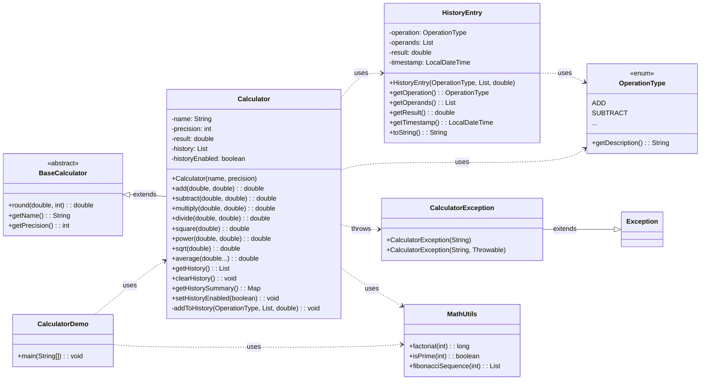
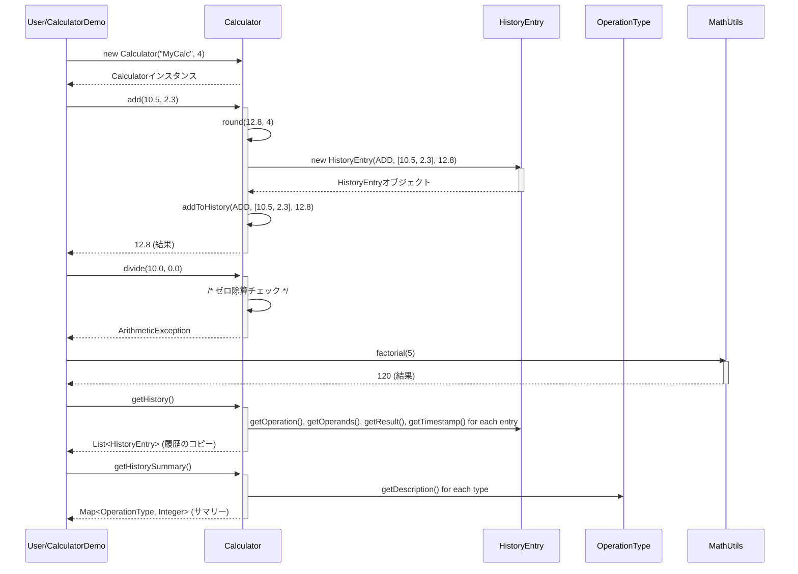

# Calculator 詳細設計書

## 1. 概要

### システム概要
本システムは、基本的な算術演算（加減乗除、平方根、累乗、二乗、平均）と、高度な数学ユーティリティ（階乗、素数判定、フィボナッチ数列）を提供する電卓アプリケーションです。全ての計算操作は履歴として記録され、必要に応じて参照・集計が可能です。高精度な数値計算と堅牢な例外処理により、信頼性の高い計算結果を提供します。

### 対象範囲（ファイル）
本設計書の対象範囲は、以下の主要なクラスファイルとその関連ファイルです。
*   `Calculator.java`: 電卓の主要な計算機能と履歴管理機能を提供します。
*   `BaseCalculator.java`: `Calculator`クラスの共通基盤となる抽象クラスです。
*   `MathUtils.java`: 汎用的な数学ユーティリティ機能を提供します。
*   `HistoryEntry.java`: 計算履歴の各エントリを表現するデータクラスです。
*   `OperationType.java`: サポートされる計算操作の種類を定義する列挙型です。
*   `CalculatorException.java`: 電卓操作中に発生するカスタム例外クラスです。
*   `CalculatorDemo.java`: アプリケーションのエントリポイントであり、電卓機能のデモンストレーションを行います。

### 前提条件・制約事項
*   **実行環境**: Java Runtime Environment (JRE) 8以上がインストールされていること。
*   **数値精度**: `BigDecimal`クラスを使用して浮動小数点数の計算精度を保証し、指定された精度で丸め処理を行います。
*   **例外処理**: ゼロ除算、負の数の平方根、不正な入力（例: 負の階乗）など、予期されるエラーに対して適切な例外処理を実装します。
*   **モジュール構成**: システムは単一のモジュール（Javaパッケージまたは単一のJARファイル）として構成されます。

## 2. アーキテクチャ設計

### システム構成図


### 処理フロー概要
本システムは、`CalculatorDemo`クラスの`main`メソッドをエントリポイントとして起動します。`main`メソッドは`Calculator`インスタンスを初期化し、ユーザーからの入力（またはデモンストレーション用の固定値）に基づいて各種計算メソッドを呼び出します。計算結果は`Calculator`内部で管理され、同時に`HistoryEntry`オブジェクトとして計算履歴に記録されます。`MathUtils`クラスは、`Calculator`とは独立した数学ユーティリティ機能を提供し、必要に応じて`CalculatorDemo`から直接呼び出されます。計算中に発生したエラーは`CalculatorException`などの例外として捕捉され、適切なエラーメッセージが標準出力に表示されます。

### 主要コンポーネント間の関係
*   **`Calculator`**: システムのコアロジックを担い、基本的な算術演算と履歴管理機能を提供します。`BaseCalculator`を継承し、共通の丸め処理や電卓名・精度の管理を行います。
*   **`BaseCalculator`**: `Calculator`クラスの共通基盤として、数値の丸め処理、電卓の名前・精度の取得といった共通機能を抽象化して提供します。これにより、将来的な電卓機能の拡張や派生クラスの追加が容易になります。
*   **`MathUtils`**: `Calculator`とは独立した、汎用的な数学ユーティリティ（階乗、素数判定、フィボナッチ数列）を提供します。これらの機能は静的メソッドとして提供され、再利用性を高めています。
*   **`HistoryEntry`**: 個々の計算操作の詳細（操作タイプ、オペランド、結果、タイムスタンプ）をカプセル化するデータモデルです。`Calculator`クラスが履歴を記録する際に利用します。
*   **`OperationType`**: 電卓でサポートされる全ての計算操作の種類を定義する列挙型です。履歴記録や履歴サマリー生成において、操作の識別子として利用されます。
*   **`CalculatorException`**: 電卓アプリケーション固有のビジネスロジックエラー（例: ゼロ除算、負の数の平方根）を表現するためのカスタム例外です。これにより、標準例外と区別し、より具体的なエラーハンドリングを可能にします。
*   **`CalculatorDemo`**: アプリケーションの実行エントリポイントであり、`Calculator`と`MathUtils`の機能を呼び出して、システム全体の動作をデモンストレーションします。

### 関連するファイルや処理・呼び出されるメソッド・呼び出し元のメソッド
*   `CalculatorDemo.main()`:
    *   `Calculator`のコンストラクタを呼び出し、インスタンスを生成。
    *   `Calculator.add()`, `subtract()`, `multiply()`, `divide()`, `square()`, `power()`, `sqrt()`, `average()` などの計算メソッドを呼び出し。
    *   `Calculator.getHistory()`, `clearHistory()`, `getHistorySummary()`, `setHistoryEnabled()` などの履歴管理メソッドを呼び出し。
    *   `MathUtils.factorial()`, `isPrime()`, `fibonacciSequence()` などの数学ユーティリティメソッドを呼び出し。
    *   `CalculatorException`, `ArithmeticException`, `IllegalArgumentException` などの例外を捕捉し、エラーメッセージを出力。
*   `Calculator`クラスの各計算メソッド (`add`, `subtract`, `multiply`, `divide`, `square`, `power`, `sqrt`, `average`):
    *   内部的に `round()` メソッドを呼び出し、計算結果を丸める。
    *   内部的に `addToHistory()` メソッドを呼び出し、計算操作を履歴に記録。
    *   `divide()` や `sqrt()`、`average()` は、不正な入力に対して `ArithmeticException` や `IllegalArgumentException`、`CalculatorException` をスローする可能性がある。
*   `Calculator.addToHistory()`:
    *   `HistoryEntry`のコンストラクタを呼び出し、新しい履歴エントリを生成。
    *   `OperationType`列挙型を使用して操作の種類を識別。
*   `Calculator.getHistorySummary()`:
    *   `HistoryEntry`のリストを走査し、各`HistoryEntry.getOperation()`を呼び出して操作タイプを取得。
    *   `OperationType`をキーとする`Map`を生成し、集計結果を格納。

## 3. クラス・メソッド設計

### 3.1 クラス・メソッド一覧表

| クラス名 | 役割 | 主要メソッド | 備考 |
| -------- | ---- | ------------ | ---- |
| Calculator | 基本演算と履歴管理を提供 | add, subtract, multiply... | BaseCalculatorを継承 |
| BaseCalculator | 電卓機能の共通基盤を提供 | round, getName, getPrecision | 抽象クラス |
| MathUtils | 汎用的な数学計算ユーティリティ | factorial, isPrime, fibonacciSequence | 静的メソッド中心 |
| HistoryEntry | 計算履歴の単一エントリを表現 | getOperation, getOperands, getResult... | 値オブジェクト |
| OperationType | 計算操作の種類を定義する | getDescription | 列挙型 (enum) |
| CalculatorException | 電卓固有のカスタム例外 | CalculatorException | 標準Exceptionを継承 |
| CalculatorDemo | 電卓機能のデモンストレーション | main | エントリポイント |

### 3.2 クラス・メソッド詳細仕様

#### クラス: `BaseCalculator`

*   **クラス概要**: 電卓機能の共通基盤を提供する抽象クラスです。電卓の名前、計算精度、および数値の丸め処理といった共通の属性とメソッドを定義します。これにより、`Calculator`クラスがこれらの共通ロジックを再利用し、保守性・拡張性を向上させます。
*   **属性一覧**:
    *   `name`: `String`型, 初期値: `null`, 説明: 電卓インスタンスの識別名。
    *   `precision`: `int`型, 初期値: `2`, 説明: 計算結果の小数点以下の桁数。
*   **メソッド仕様**:
    *   **`BaseCalculator(String name, int precision)`** (コンストラクタ)
        *   引数: `name` (String), `precision` (int)
        *   戻り値: なし
        *   処理概要: 電卓のインスタンスを初期化します。指定された名前と精度を設定します。
        *   例外: なし
    *   **`round(double value, int precision)`**
        *   引数: `value` (double), `precision` (int)
        *   戻り値: `double`
        *   処理概要: 与えられた`double`型の数値を、`BigDecimal`を使用して指定された精度で四捨五入（`HALF_UP`）し、`double`型で返却します。
        *   例外: なし
    *   **`getName()`**
        *   引数: なし
        *   戻り値: `String`
        *   処理概要: この電卓インスタンスに設定された名前を取得します。
        *   例外: なし
    *   **`getPrecision()`**
        *   引数: なし
        *   戻り値: `int`
        *   処理概要: この電卓インスタンスの現在の計算精度設定を取得します。
        *   例外: なし
*   **継承・実装関係**:
    *   継承元: なし
    *   継承先: `Calculator`

#### クラス: `Calculator`

*   **クラス概要**: 電卓の主要な計算機能と履歴管理機能を提供します。`BaseCalculator`を継承し、加減乗除、平方根、累乗、平均などの算術演算を実行し、その結果を履歴に記録します。履歴の有効/無効設定やサマリー表示も可能です。
*   **属性一覧**:
    *   `result`: `double`型, 初期値: `0.0`, 説明: 現在の計算結果。
    *   `history`: `List<HistoryEntry>`型, 初期値: `new ArrayList<>()`, 説明: 計算履歴を保持するリスト。
    *   `historyEnabled`: `boolean`型, 初期値: `true`, 説明: 履歴記録機能の有効/無効フラグ。
    *   (継承属性: `name`, `precision`)
*   **メソッド仕様**:
    *   **`Calculator()`** (コンストラクタ)
        *   引数: なし
        *   戻り値: なし
        *   処理概要: デフォルトの名前と精度で`Calculator`インスタンスを初期化します。
        *   例外: なし
    *   **`Calculator(String name)`** (コンストラクタ)
        *   引数: `name` (String)
        *   戻り値: なし
        *   処理概要: 指定された名前とデフォルトの精度で`Calculator`インスタンスを初期化します。
        *   例外: なし
    *   **`Calculator(String name, int precision)`** (コンストラクタ)
        *   引数: `name` (String), `precision` (int)
        *   戻り値: なし
        *   処理概要: 指定された名前と精度で`Calculator`インスタンスを初期化します。
        *   例外: なし
    *   **`add(double a, double b)`**
        *   引数: `a` (double), `b` (double)
        *   戻り値: `double`
        *   処理概要: 2つの数値を加算し、結果を丸めて返します。同時に、この演算を履歴に記録します。
        *   例外: なし
    *   **`subtract(double a, double b)`**
        *   引数: `a` (double), `b` (double)
        *   戻り値: `double`
        *   処理概要: 2つの数値の減算を実行し、結果を丸めて、その操作を履歴に記録します。
        *   例外: なし
    *   **`multiply(double a, double b)`**
        *   引数: `a` (double), `b` (double)
        *   戻り値: `double`
        *   処理概要: 2つの数値を乗算し、結果を丸めて返します。同時に、この計算操作を履歴に記録します。
        *   例外: なし
    *   **`divide(double a, double b)`**
        *   引数: `a` (double), `b` (double)
        *   戻り値: `double`
        *   処理概要: 2つの数値の除算を実行し、ゼロ除算を検出して`ArithmeticException`をスローします。結果を丸めて計算履歴に記録します。
        *   例外: `ArithmeticException` (bが0の場合)
    *   **`square(double value)`**
        *   引数: `value` (double)
        *   戻り値: `double`
        *   処理概要: 入力された数値の二乗を計算し、結果を丸めて操作履歴に記録します。
        *   例外: なし
    *   **`power(double base, double exponent)`**
        *   引数: `base` (double), `exponent` (double)
        *   戻り値: `double`
        *   処理概要: 与えられた基数と指数に基づき累乗計算を行い、結果を丸めて返却し、その操作を履歴に記録します。
        *   例外: なし
    *   **`sqrt(double value)`**
        *   引数: `value` (double)
        *   戻り値: `double`
        *   処理概要: 与えられた数値の平方根を計算します。入力値が負の場合には`CalculatorException`をスローし、計算結果を丸めて返却するとともに、操作履歴に記録します。
        *   例外: `CalculatorException` (valueが負の場合)
    *   **`average(double... values)`**
        *   引数: `values` (可変長引数 double)
        *   戻り値: `double`
        *   処理概要: 可変長引数として渡された`double`型数値の平均値を計算します。入力配列が空の場合には`CalculatorException`をスローします。計算結果は丸め処理が施されます。
        *   例外: `CalculatorException` (valuesが空の場合)
    *   **`getHistory()`**
        *   引数: なし
        *   戻り値: `List<HistoryEntry>`
        *   処理概要: 内部に保持されている計算履歴のリストのコピーを返却します。これにより、外部からの履歴リストへの直接的な変更を防ぎ、内部状態の整合性を保ちます。
        *   例外: なし
    *   **`clearHistory()`**
        *   引数: なし
        *   戻り値: `void`
        *   処理概要: 電卓の計算履歴をすべて消去します。
        *   例外: なし
    *   **`getHistorySummary()`**
        *   引数: なし
        *   戻り値: `Map<OperationType, Integer>`
        *   処理概要: 過去の計算操作履歴を分析し、各`OperationType`（操作種別）の実行回数を集計したサマリーマップを生成します。
        *   例外: なし
    *   **`setHistoryEnabled(boolean enabled)`**
        *   引数: `enabled` (boolean)
        *   戻り値: `void`
        *   処理概要: 電卓の履歴機能の有効/無効を設定します。
        *   例外: なし
    *   **`getResult()`**
        *   引数: なし
        *   戻り値: `double`
        *   処理概要: 現在の計算結果である`result`フィールドの値を返します。
        *   例外: なし
    *   **`toString()`** (オーバーライド)
        *   引数: なし
        *   戻り値: `String`
        *   処理概要: `Calculator`オブジェクトの文字列表現を生成します。現在の結果や履歴の概要を含む、人間が読める形式の文字列を返します。
        *   例外: なし
    *   **`addToHistory(OperationType operation, List<Double> operands, double result)`** (private)
        *   引数: `operation` (OperationType), `operands` (List<Double>), `result` (double)
        *   戻り値: `void`
        *   処理概要: 計算の操作タイプ、使用されたオペランド、および計算結果を履歴として記録します。履歴記録は、`enableHistory`フラグが有効な場合にのみ実行されます。
        *   例外: なし
*   **継承・実装関係**:
    *   継承元: `BaseCalculator`
    *   実装インターフェース: なし

#### クラス: `MathUtils`

*   **クラス概要**: 汎用的な数学計算ユーティリティ機能を提供するクラスです。階乗計算、素数判定、フィボナッチ数列生成といった、電卓の基本機能とは独立した数学的アルゴリズムを提供します。全てのメソッドは静的メソッドとして提供され、インスタンス化せずに利用可能です。
*   **属性一覧**: なし (全て静的メソッドのため)
*   **メソッド仕様**:
    *   **`factorial(int n)`** (static)
        *   引数: `n` (int)
        *   戻り値: `long`
        *   処理概要: 与えられた非負整数の階乗を計算します。負の数が入力された場合は`IllegalArgumentException`をスローします。
        *   例外: `IllegalArgumentException` (nが負の場合)
    *   **`isPrime(int n)`** (static)
        *   引数: `n` (int)
        *   戻り値: `boolean`
        *   処理概要: 与えられた整数が素数であるかを判定します。1以下の数値は素数ではないと判定します。
        *   例外: なし
    *   **`fibonacciSequence(int length)`** (static)
        *   引数: `length` (int)
        *   戻り値: `List<Integer>`
        *   処理概要: 指定された長さのフィボナッチ数列を生成します。長さが負の場合や0の場合は空のリストを返します。
        *   例外: なし
*   **継承・実装関係**: なし

#### クラス: `HistoryEntry`

*   **クラス概要**: 個々の計算履歴エントリを表現するデータクラスです。計算操作の種類、使用されたオペランド、計算結果、および操作が実行されたタイムスタンプを保持します。不変オブジェクトとして設計されており、一度作成されると内部状態は変更されません。
*   **属性一覧**:
    *   `operation`: `OperationType`型, 初期値: (コンストラクタで設定), 説明: 実行された計算操作の種類。
    *   `operands`: `List<Double>`型, 初期値: (コンストラクタで設定), 説明: 計算に使用されたオペランドのリスト。
    *   `result`: `double`型, 初期値: (コンストラクタで設定), 説明: 計算の結果。
    *   `timestamp`: `LocalDateTime`型, 初期値: (コンストラクタで設定), 説明: 履歴エントリが作成された日時。
*   **メソッド仕様**:
    *   **`HistoryEntry(OperationType operation, List<Double> operands, double result)`** (コンストラクタ)
        *   引数: `operation` (OperationType), `operands` (List<Double>), `result` (double)
        *   戻り値: なし
        *   処理概要: 計算履歴エントリの新しいインスタンスを初期化します。タイムスタンプはインスタンス生成時に自動的に設定されます。
        *   例外: なし
    *   **`getOperation()`**
        *   引数: なし
        *   戻り値: `OperationType`
        *   処理概要: この履歴エントリの演算タイプを取得します。
        *   例外: なし
    *   **`getOperands()`**
        *   引数: なし
        *   戻り値: `List<Double>`
        *   処理概要: この履歴エントリで使用されたオペランドのリストの防御的コピーを取得します。
        *   例外: なし
    *   **`getResult()`**
        *   引数: なし
        *   戻り値: `double`
        *   処理概要: この履歴エントリの計算結果を取得します。
        *   例外: なし
    *   **`getTimestamp()`**
        *   引数: なし
        *   戻り値: `LocalDateTime`
        *   処理概要: この履歴エントリが作成されたタイムスタンプを取得します。
        *   例外: なし
    *   **`toString()`** (オーバーライド)
        *   引数: なし
        *   戻り値: `String`
        *   処理概要: この履歴エントリの人間が読める文字列表現を生成します。操作、オペランド、結果、タイムスタンプを含む形式です。
        *   例外: なし
*   **継承・実装関係**: なし

#### 列挙型: `OperationType`

*   **クラス概要**: 電卓でサポートされる全ての計算操作の種類を定義する列挙型（enum）です。各操作には、人間が読める説明が関連付けられています。これにより、操作の識別と表示が統一的に行えます。
*   **属性一覧**:
    *   `description`: `String`型, 初期値: (各列挙子で定義), 説明: 操作の人間が読める説明。
*   **メソッド仕様**:
    *   **`getDescription()`**
        *   引数: なし
        *   戻り値: `String`
        *   処理概要: この演算タイプの人間が読める説明を返します。
        *   例外: なし
*   **継承・実装関係**: なし

#### クラス: `CalculatorException`

*   **クラス概要**: 電卓アプリケーション固有の例外を表現するカスタム例外クラスです。標準の`Exception`クラスを継承しており、電卓のビジネスロジックに特化したエラー（例: 不正な入力、特定の計算制約違反）を捕捉・通知するために使用されます。
*   **属性一覧**: なし (標準Exceptionの属性を継承)
*   **メソッド仕様**:
    *   **`CalculatorException(String message)`** (コンストラクタ)
        *   引数: `message` (String)
        *   戻り値: なし
        *   処理概要: 指定されたエラーメッセージを持つ`CalculatorException`の新しいインスタンスを初期化します。
        *   例外: なし
    *   **`CalculatorException(String message, Throwable cause)`** (コンストラクタ)
        *   引数: `message` (String), `cause` (Throwable)
        *   戻り値: なし
        *   処理概要: 指定されたエラーメッセージと、この例外の原因となる`Throwable`オブジェクトを持つ`CalculatorException`の新しいインスタンスを初期化します。
        *   例外: なし
*   **継承・実装関係**:
    *   継承元: `java.lang.Exception`

## 4. インターフェース設計

本システムは単一モジュールで構成されており、外部に公開するAPIは主に`Calculator`クラスと`MathUtils`クラスの公開メソッドとなります。

### API 仕様

#### `Calculator` クラス (主要な公開メソッド)

*   **`Calculator(String name, int precision)`**: 電卓インスタンスを初期化します。
    *   `name`: 電卓の名前 (String)
    *   `precision`: 計算精度 (int)
*   **`double add(double a, double b)`**: 2つの数値を加算します。
*   **`double subtract(double a, double b)`**: 2つの数値を減算します。
*   **`double multiply(double a, double b)`**: 2つの数値を乗算します。
*   **`double divide(double a, double b)`**: 2つの数値を除算します。`b`が0の場合`ArithmeticException`をスロー。
*   **`double square(double value)`**: 数値の二乗を計算します。
*   **`double power(double base, double exponent)`**: 基数を指数で累乗します。
*   **`double sqrt(double value)`**: 数値の平方根を計算します。`value`が負の場合`CalculatorException`をスロー。
*   **`double average(double... values)`**: 複数の数値の平均を計算します。`values`が空の場合`CalculatorException`をスロー。
*   **`List<HistoryEntry> getHistory()`**: 計算履歴のリスト（防御的コピー）を取得します。
*   **`void clearHistory()`**: 計算履歴をクリアします。
*   **`Map<OperationType, Integer> getHistorySummary()`**: 操作タイプごとの計算回数を集計したマップを取得します。
*   **`void setHistoryEnabled(boolean enabled)`**: 履歴記録の有効/無効を設定します。
*   **`double getResult()`**: 現在の計算結果を取得します。
*   **`String getName()`**: 電卓の名前を取得します。
*   **`int getPrecision()`**: 計算精度を取得します。

#### `MathUtils` クラス (主要な公開静的メソッド)

*   **`static long factorial(int n)`**: 階乗を計算します。`n`が負の場合`IllegalArgumentException`をスロー。
*   **`static boolean isPrime(int n)`**: 素数判定を行います。
*   **`static List<Integer> fibonacciSequence(int length)`**: 指定された長さのフィボナッチ数列を生成します。

### 入出力データ形式

*   **数値入力**: `double`型 (例: `add(10.5, 2.3)`)
*   **整数入力**: `int`型 (例: `factorial(5)`)
*   **可変長数値入力**: `double...` (例: `average(1.0, 2.0, 3.0)`)
*   **履歴出力**: `List<HistoryEntry>`
    *   `HistoryEntry`内部: `OperationType` (enum), `List<Double>`, `double`, `LocalDateTime`
*   **履歴サマリー出力**: `Map<OperationType, Integer>`
*   **ブール値**: `boolean` (例: `setHistoryEnabled(true)`)
*   **文字列**: `String` (例: `getName()`, `toString()`)

### エラーレスポンス仕様

各メソッドは、以下の例外をスローする可能性があります。これらの例外は、呼び出し元で適切に捕捉し、ユーザーへのフィードバックやログ記録を行う必要があります。

*   **`java.lang.ArithmeticException`**:
    *   発生箇所: `Calculator.divide()` (ゼロ除算時)
    *   メッセージ例: "Division by zero is not allowed."
*   **`java.lang.IllegalArgumentException`**:
    *   発生箇所: `MathUtils.factorial()` (負の数が入力された場合)
    *   メッセージ例: "Factorial is not defined for negative numbers."
*   **`CalculatorException`**:
    *   発生箇所: `Calculator.sqrt()` (負の数の平方根計算時)
    *   メッセージ例: "Cannot calculate square root of a negative number."
    *   発生箇所: `Calculator.average()` (空の配列が入力された場合)
    *   メッセージ例: "Cannot calculate average of an empty array."
    *   発生箇所: コンストラクタ (`CalculatorException(String message, Throwable cause)`) で、より具体的な原因をラップする場合。

## 5. データ設計

### データ構造

本システムは、計算履歴をメモリ上で管理します。永続化のためのデータベースは使用しません。

#### `Calculator` クラスの内部状態

*   **`result`**: `double`
    *   現在の計算結果を保持します。
*   **`history`**: `java.util.List<HistoryEntry>`
    *   `HistoryEntry`オブジェクトのリストとして、過去の計算操作を時系列で保持します。
*   **`historyEnabled`**: `boolean`
    *   履歴記録機能が有効か無効かを制御するフラグです。
*   **`name`**: `String` (BaseCalculatorから継承)
    *   電卓インスタンスの識別名。
*   **`precision`**: `int` (BaseCalculatorから継承)
    *   計算結果を丸める際の小数点以下の桁数。

#### `HistoryEntry` クラス

個々の計算履歴エントリを表すデータ構造です。

| 属性名 | 型 | 説明 |
| ------ | -- | ---- |
| `operation` | `OperationType` | 実行された計算操作の種類（例: ADD, SUBTRACT） |
| `operands` | `java.util.List<Double>` | 計算に使用された数値のリスト |
| `result` | `double` | 計算によって得られた結果 |
| `timestamp` | `java.time.LocalDateTime` | 履歴エントリが作成された日時 |

#### `OperationType` 列挙型

電卓でサポートされる操作の種類を定義します。

| 列挙子 | 説明 (`description`属性) |
| ------ | ------------------------ |
| `ADD` | 加算                     |
| `SUBTRACT` | 減算                     |
| `MULTIPLY` | 乗算                     |
| `DIVIDE` | 除算                     |
| `SQUARE` | 二乗                     |
| `POWER` | 累乗                     |
| `SQRT` | 平方根                   |
| `AVERAGE` | 平均                     |
| `FACTORIAL` | 階乗                     |
| `IS_PRIME` | 素数判定                 |
| `FIBONACCI` | フィボナッチ数列           |
| `CLEAR_HISTORY` | 履歴クリア               |
| `GET_HISTORY` | 履歴取得                 |
| `GET_HISTORY_SUMMARY` | 履歴サマリー取得         |
| `SET_HISTORY_ENABLED` | 履歴有効化/無効化        |

### データベーステーブル設計
本システムは、計算履歴をメモリ上で管理するため、データベースは使用しません。

### データフロー図
```mermaid
flowchart TD
    A[ユーザー操作/CalculatorDemo] --> B{Calculatorインスタンス};
    B -- 数値入力 --> C[Calculator.add/subtract/etc()];
    C -- 計算結果 --> D[Calculator.result];
    C -- 操作詳細 --> E[Calculator.addToHistory()];
    E -- HistoryEntry生成 --> F[HistoryEntryオブジェクト];
    F --> G[Calculator.history (List)];
    G -- 履歴取得 --> H[Calculator.getHistory()];
    G -- 履歴集計 --> I[Calculator.getHistorySummary()];
    H -- List<HistoryEntry> --> J[結果表示];
    I -- Map<OperationType, Integer> --> J;
    C -- 例外発生 --> K[CalculatorException/ArithmeticException];
    K --> L[エラーメッセージ表示];
    A -- 数学ユーティリティ呼び出し --> M[MathUtils.factorial/isPrime/fibonacciSequence()];
    M -- 結果 --> J;
```

## 6. 処理設計

### 6.1 主要処理フロー

#### シーケンス図での表現
以下は、`CalculatorDemo`が`Calculator`と`MathUtils`の機能を利用する典型的なシーケンスを示します。



#### 処理ステップの詳細説明

1.  **電卓インスタンスの初期化 (`CalculatorDemo` -> `Calculator`)**
    *   `CalculatorDemo`は、`Calculator`クラスのコンストラクタ（例: `new Calculator("MyCalculator", 4)`) を呼び出し、電卓インスタンスを生成します。
    *   コンストラクタは、電卓の名前、計算精度、および履歴リストなどの内部状態を初期化します。デフォルトでは履歴記録は有効です。

2.  **算術演算の実行 (`CalculatorDemo` -> `Calculator.add/subtract/multiply/divide/square/power/sqrt/average`)**
    *   `CalculatorDemo`は、`Calculator`インスタンスの各算術演算メソッドを呼び出します。
    *   **入力値検証**: `divide()`はゼロ除算を、`sqrt()`は負の数の入力、`average()`は空配列をチェックし、それぞれ`ArithmeticException`、`CalculatorException`をスローします。
    *   **計算実行**: 適切な計算ロジック（例: `+`, `-`, `*`, `/`, `Math.pow`, `Math.sqrt`）を実行します。
    *   **結果の丸め**: 計算結果は、`BaseCalculator`から継承した`round()`メソッドを使用して、設定された精度で丸められます。これにより、浮動小数点計算の誤差を管理し、一貫した結果を提供します。
    *   **履歴記録**: `addToHistory()`プライベートメソッドが呼び出され、操作タイプ、使用されたオペランド、および丸められた計算結果が`HistoryEntry`オブジェクトとして`history`リストに追加されます。この処理は`historyEnabled`フラグが`true`の場合にのみ実行されます。

3.  **数学ユーティリティの利用 (`CalculatorDemo` -> `MathUtils.factorial/isPrime/fibonacciSequence`)**
    *   `CalculatorDemo`は、`MathUtils`クラスの静的メソッドを直接呼び出します。
    *   **入力値検証**: `factorial()`は負の数をチェックし、`IllegalArgumentException`をスローします。
    *   **計算実行**: 各メソッドは、それぞれの数学的アルゴリズム（例: 階乗の再帰計算、素数判定のループ、フィボナッチ数列の生成）を実行し、結果を返します。これらの操作は`Calculator`の履歴には記録されません。

4.  **履歴の取得と管理 (`CalculatorDemo` -> `Calculator.getHistory/clearHistory/getHistorySummary/setHistoryEnabled`)**
    *   **`getHistory()`**: `history`リストの防御的コピーを返します。これにより、外部からのリストへの直接的な変更を防ぎ、`Calculator`の内部状態の整合性を保ちます。
    *   **`clearHistory()`**: `history`リストをクリアし、全ての履歴を消去します。
    *   **`getHistorySummary()`**: `history`リストを走査し、各`OperationType`ごとの実行回数を集計した`Map`を生成して返します。`EnumMap`を使用することで、列挙型をキーとするマップの効率的な処理を実現します。
    *   **`setHistoryEnabled()`**: `historyEnabled`フラグを更新し、以降の計算操作の履歴記録を有効または無効にします。

5.  **例外処理 (`CalculatorDemo` / 各メソッド内)**
    *   各計算メソッドは、不正な入力や実行時エラー（例: ゼロ除算）に対して、適切な標準例外（`ArithmeticException`, `IllegalArgumentException`）またはカスタム例外（`CalculatorException`）をスローします。
    *   `CalculatorDemo`の`main`メソッドは、これらの例外を`try-catch`ブロックで捕捉し、ユーザーに分かりやすいエラーメッセージを標準エラー出力に表示します。これにより、アプリケーションの堅牢性が向上します。

**保守性・拡張性の観点:**
*   **責務の分離**: `Calculator`は計算と履歴管理、`MathUtils`は汎用数学、`HistoryEntry`はデータモデルと、各クラスが明確な責務を持つように設計されています。これにより、特定の機能の変更が他の部分に与える影響を最小限に抑えられます。
*   **継承の利用**: `BaseCalculator`を抽象クラスとして導入することで、`Calculator`クラスにおける共通の丸め処理や基本設定の管理が抽象化され、将来的に異なる種類の電卓（例: 科学計算用電卓）を追加する際の共通基盤として再利用可能です。
*   **列挙型の活用**: `OperationType`列挙型を使用することで、計算操作の種類が明確に定義され、履歴記録やサマリー生成において型安全な方法で操作を識別できます。新しい操作を追加する際も、列挙子を追加するだけで対応可能です。
*   **カスタム例外**: `CalculatorException`を定義することで、電卓アプリケーション固有のビジネスロジックエラーを標準例外と区別し、より具体的なエラーハンドリングとデバッグを容易にします。
*   **防御的コピー**: `getHistory()`や`getOperands()`でリストの防御的コピーを返すことで、`Calculator`や`HistoryEntry`の内部状態が外部から意図せず変更されることを防ぎ、データ整合性を保ちます。
*   **高精度計算**: `BigDecimal`を使用することで、浮動小数点計算の精度に関する問題を回避し、ビジネス要件に応じた正確な計算結果を提供できます。これは、金融計算など精度が求められる場面での拡張性にも寄与します。