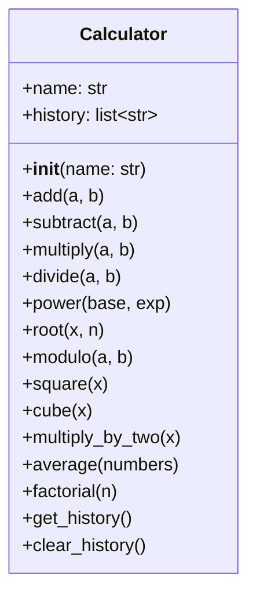
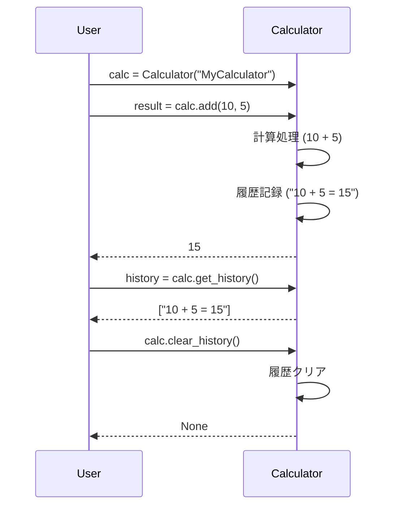

# test_sample 詳細設計書

## 1. 概要

### システム概要
本システムは、基本的な数値計算機能と、その操作履歴を管理する機能を提供する単一モジュール構成の計算機システムです。ユーザーはインスタンスを通じて様々な計算を実行し、その履歴を確認・管理できます。

### 対象範囲（ファイル）
`calculator_module.py`

### 前提条件・制約事項
*   Python 3.8以上の実行環境が必要です。
*   標準ライブラリのみを使用し、外部ライブラリへの依存はありません。
*   数値計算は整数（`int`）および浮動小数点数（`float`）に対応します。

## 2. アーキテクチャ設計

### システム構成図
本システムは、`calculator_module.py` ファイル内に定義された単一の `Calculator` クラスを中心に構成されます。



### 処理フロー概要
ユーザーは `Calculator` クラスのインスタンスを生成し、そのインスタンスを通じて各種計算メソッド（例: `add`, `subtract`）を呼び出します。各計算メソッドは、指定された計算を実行し、その結果を呼び出し元に返します。同時に、実行された計算操作の詳細（オペランド、結果など）は、インスタンス内部の履歴リスト（`self.history`）に自動的に記録されます。ユーザーは `get_history` メソッドで履歴を取得し、`clear_history` メソッドで履歴を消去できます。

### 主要コンポーネント間の関係
*   **Calculatorクラス**: システムの核となるコンポーネントであり、すべての計算ロジックと履歴管理機能を集約しています。
*   **self.history属性**: `Calculator` クラスの内部状態として、実行された計算操作の履歴を文字列リストとして保持します。

### 関連するファイルや処理・呼び出されるメソッド・呼び出し元のメソッド
*   **ファイル**: `calculator_module.py`
*   **主要な処理**: `Calculator` インスタンスの生成、計算メソッドの呼び出し、履歴の記録・取得・クリア。
*   **呼び出されるメソッド**: `Calculator` クラスの各計算メソッド (`add`, `subtract` など)、`get_history`, `clear_history`。
*   **呼び出し元のメソッド**: ユーザーコード（アプリケーションのエントリポイントや他のモジュール）。

## 3. クラス・メソッド設計

### 3.1 クラス・メソッド一覧表

| クラス名   | 役割                 | 主要メソッド                                | 備考       |
| ---------- | -------------------- | ------------------------------------------- | ---------- |
| `Calculator` | 数値計算機能と履歴管理 | `__init__, add, subtract, multiply, divide...` | パターン: なし |

### 3.2 クラス・メソッド詳細仕様

#### クラス名: `Calculator`

*   **クラス概要**:
    基本的な数値計算機能（加算、減算、乗算、除算、べき乗、平方根、剰余、二乗、三乗、2倍、平均、階乗）を提供し、実行されたすべての計算操作の履歴を管理します。

*   **属性一覧**:
    | 属性名    | 型          | 初期値           | 説明                                     |
    | --------- | ----------- | ---------------- | ---------------------------------------- |
    | `name`    | `str`       | `"DefaultCalc"`  | 計算機の識別名。                         |
    | `history` | `list[str]` | `[]`             | 実行された計算操作の履歴を格納するリスト。 |

*   **メソッド仕様**:

    1.  **`__init__(self, name: str = "DefaultCalc") -> None`**
        *   **引数**:
            *   `name` (`str`): 計算機の名前。デフォルトは`"DefaultCalc"`。
        *   **戻り値**: `None`
        *   **処理概要**:
            `Calculator` インスタンスを初期化します。指定された名前を `self.name` に設定し、計算履歴を格納するための空のリスト `self.history` を準備します。
        *   **例外**: なし

    2.  **`add(self, a: Union[int, float], b: Union[int, float]) -> Union[int, float]`**
        *   **引数**:
            *   `a` (`Union[int, float]`): 加算される最初の数値。
            *   `b` (`Union[int, float]`): 加算される2番目の数値。
        *   **戻り値**: `Union[int, float]` (加算結果)
        *   **処理概要**:
            `a` と `b` を加算し、その結果を返します。同時に、加算操作の詳細（例: "10 + 5 = 15"）を `self.history` に記録します。
        *   **例外**: なし

    3.  **`subtract(self, a: Union[int, float], b: Union[int, float]) -> Union[int, float]`**
        *   **引数**:
            *   `a` (`Union[int, float]`): 減算される最初の数値。
            *   `b` (`Union[int, float]`): 減算される2番目の数値。
        *   **戻り値**: `Union[int, float]` (減算結果)
        *   **処理概要**:
            `a` から `b` を減算し、その結果を返します。減算操作の詳細を `self.history` に記録します。
        *   **例外**: なし

    4.  **`multiply(self, a: Union[int, float], b: Union[int, float]) -> Union[int, float]`**
        *   **引数**:
            *   `a` (`Union[int, float]`): 乗算される最初の数値。
            *   `b` (`Union[int, float]`): 乗算される2番目の数値。
        *   **戻り値**: `Union[int, float]` (乗算結果)
        *   **処理概要**:
            `a` と `b` を乗算し、その結果を返します。乗算操作の詳細を `self.history` に記録します。
        *   **例外**: なし

    5.  **`divide(self, a: Union[int, float], b: Union[int, float]) -> Union[int, float]`**
        *   **引数**:
            *   `a` (`Union[int, float]`): 除算される数値（被除数）。
            *   `b` (`Union[int, float]`): 除算する数値（除数）。
        *   **戻り値**: `Union[int, float]` (除算結果)
        *   **処理概要**:
            `a` を `b` で除算し、その結果を返します。ゼロ除算 (`b` が 0 の場合) を検出し、`ValueError` を発生させます。除算操作の詳細を `self.history` に記録します。
        *   **例外**: `ValueError` (除数が0の場合)

    6.  **`power(self, base: Union[int, float], exp: Union[int, float]) -> Union[int, float]`**
        *   **引数**:
            *   `base` (`Union[int, float]`): べき乗の底。
            *   `exp` (`Union[int, float]`): べき乗の指数。
        *   **戻り値**: `Union[int, float]` (べき乗結果)
        *   **処理概要**:
            `base` の `exp` 乗を計算し、その結果を返します。べき乗操作の詳細を `self.history` に記録します。
        *   **例外**: なし

    7.  **`root(self, x: Union[int, float], n: Union[int, float] = 2) -> Union[int, float]`**
        *   **引数**:
            *   `x` (`Union[int, float]`): n乗根を計算する数値。
            *   `n` (`Union[int, float]`): 根の指数。デフォルトは2（平方根）。
        *   **戻り値**: `Union[int, float]` (n乗根の結果)
        *   **処理概要**:
            `x` の `n` 乗根を計算し、その結果を返します。`n` が指定されない場合は平方根を計算します。操作の詳細を `self.history` に記録します。
        *   **例外**: なし (負の数の偶数乗根など、数学的に定義されないケースはPythonの`**`演算子に委ねる)

    8.  **`modulo(self, a: Union[int, float], b: Union[int, float]) -> Union[int, float]`**
        *   **引数**:
            *   `a` (`Union[int, float]`): 剰余を計算する数値（被除数）。
            *   `b` (`Union[int, float]`): 剰余を計算する数値（除数）。
        *   **戻り値**: `Union[int, float]` (剰余結果)
        *   **処理概要**:
            `a` を `b` で割った剰余を計算し、その結果を返します。剰余操作の詳細を `self.history` に記録します。
        *   **例外**: `ValueError` (除数が0の場合)

    9.  **`square(self, x: Union[int, float]) -> Union[int, float]`**
        *   **引数**:
            *   `x` (`Union[int, float]`): 二乗する数値。
        *   **戻り値**: `Union[int, float]` (二乗結果)
        *   **処理概要**:
            `x` の二乗を計算し、その結果を返します。操作の詳細を `self.history` に記録します。
        *   **例外**: なし

    10. **`cube(self, x: Union[int, float]) -> Union[int, float]`**
        *   **引数**:
            *   `x` (`Union[int, float]`): 三乗する数値。
        *   **戻り値**: `Union[int, float]` (三乗結果)
        *   **処理概要**:
            `x` の三乗を計算し、その結果を返します。操作の詳細を `self.history` に記録します。
        *   **例外**: なし

    11. **`multiply_by_two(self, x: Union[int, float]) -> Union[int, float]`**
        *   **引数**:
            *   `x` (`Union[int, float]`): 2倍する数値。
        *   **戻り値**: `Union[int, float]` (2倍の結果)
        *   **処理概要**:
            `x` を2倍し、その結果を返します。操作の詳細を `self.history` に記録します。
        *   **例外**: なし

    12. **`average(self, numbers: list[Union[int, float]]) -> Union[int, float]`**
        *   **引数**:
            *   `numbers` (`list[Union[int, float]]`): 平均を計算する数値のリスト。
        *   **戻り値**: `Union[int, float]` (平均値)
        *   **処理概要**:
            与えられた数値リスト `numbers` の平均値を計算し、その結果を返します。リストが空の場合は `ValueError` を発生させます。操作の詳細を `self.history` に記録します。
        *   **例外**: `ValueError` (入力リストが空の場合)

    13. **`factorial(self, n: int) -> int`**
        *   **引数**:
            *   `n` (`int`): 階乗を計算する非負の整数。
        *   **戻り値**: `int` (階乗結果)
        *   **処理概要**:
            指定された非負の整数 `n` の階乗（n!）を計算し、その結果を返します。`n` が負の数の場合は `ValueError` を発生させます。0! は1、1! は1とします。操作の詳細を `self.history` に記録します。
        *   **例外**: `ValueError` (入力 `n` が負の数の場合)

    14. **`get_history(self) -> list[str]`**
        *   **引数**: なし
        *   **戻り値**: `list[str]` (計算履歴のコピー)
        *   **処理概要**:
            `self.history` に格納されている計算履歴のリストのコピーを返します。これにより、外部からの履歴の意図しない変更を防ぎます。
        *   **例外**: なし

    15. **`clear_history(self) -> None`**
        *   **引数**: なし
        *   **戻り値**: `None`
        *   **処理概要**:
            `self.history` に格納されているすべての計算履歴を削除し、リストを空の状態に戻します。
        *   **例外**: なし

*   **継承・実装関係**:
    *   本クラスは他のクラスを継承せず、特定のインターフェースを実装しません。

## 4. インターフェース設計

### API 仕様
本システムのAPIは、`Calculator` クラスの公開メソッド群によって構成されます。各メソッドのシグネチャ（引数、戻り値の型）がAPI仕様となります。

*   `__init__(self, name: str = "DefaultCalc") -> None`
*   `add(self, a: Union[int, float], b: Union[int, float]) -> Union[int, float]`
*   `subtract(self, a: Union[int, float], b: Union[int, float]) -> Union[int, float]`
*   `multiply(self, a: Union[int, float], b: Union[int, float]) -> Union[int, float]`
*   `divide(self, a: Union[int, float], b: Union[int, float]) -> Union[int, float]`
*   `power(self, base: Union[int, float], exp: Union[int, float]) -> Union[int, float]`
*   `root(self, x: Union[int, float], n: Union[int, float] = 2) -> Union[int, float]`
*   `modulo(self, a: Union[int, float], b: Union[int, float]) -> Union[int, float]`
*   `square(self, x: Union[int, float]) -> Union[int, float]`
*   `cube(self, x: Union[int, float]) -> Union[int, float]`
*   `multiply_by_two(self, x: Union[int, float]) -> Union[int, float]`
*   `average(self, numbers: list[Union[int, float]]) -> Union[int, float]`
*   `factorial(self, n: int) -> int`
*   `get_history(self) -> list[str]`
*   `clear_history(self) -> None`

### 入出力データ形式
*   **入力**:
    *   数値: `int` または `float`
    *   数値リスト: `list[Union[int, float]]`
    *   文字列: `str` (計算機名)
*   **出力**:
    *   数値: `int` または `float`
    *   文字列リスト: `list[str]` (計算履歴)
    *   `None` (履歴クリアなど)

### エラーレスポンス仕様
不正な入力や実行時エラーが発生した場合、Pythonの標準例外 `ValueError` を送出します。
*   `divide` メソッド: 除数が0の場合
*   `modulo` メソッド: 除数が0の場合
*   `average` メソッド: 入力リストが空の場合
*   `factorial` メソッド: 入力値が負の数の場合

## 5. データ設計

### データ構造
本システムで管理される主要なデータは、`Calculator` クラスのインスタンス属性である `history` リストです。

*   **`self.history`**:
    *   **型**: `list[str]`
    *   **内容**: 各計算操作を記述した文字列が格納されます。
        *   例: `"10 + 5 = 15"`, `"sqrt(25) = 5.0"`, `"5! = 120"`
    *   **目的**: ユーザーが過去の計算を追跡できるようにするため。

### データベーステーブル設計
本システムはインメモリで動作し、永続的なデータストレージ（データベース）は使用しません。

### データフロー図
ユーザーからの入力が `Calculator` インスタンスのメソッドを通じて処理され、計算結果と履歴データが生成・更新される流れを示します。

```mermaid
flowchart TD
    A[ユーザー入力 (数値, リスト)] --> B(Calculatorメソッド呼び出し);
    B --> C{計算処理};
    C --> D[計算結果 (数値)];
    C --> E[履歴データ (文字列)];
    E --> F[self.history (リスト)];
    F --> G[履歴取得 (get_history)];
    G --> H[ユーザー出力 (履歴リスト)];
    D --> H;
```

## 6. 処理設計

### 6.1 主要処理フロー

本システムの主要な処理フローは、ユーザーが `Calculator` インスタンスを操作し、計算を実行するシーケンスで構成されます。ここでは、`add` メソッドの呼び出しを例にシーケンス図と詳細ステップを説明します。

#### シーケンス図



#### 処理ステップの詳細説明

1.  **インスタンス生成**:
    *   **ステップ**: ユーザーは `Calculator` クラスのコンストラクタを呼び出し、新しい `Calculator` インスタンスを生成します。必要に応じて計算機名を指定します。
    *   **内部処理**: `__init__` メソッドが実行され、`self.name` が設定され、`self.history` が空のリストとして初期化されます。

2.  **計算メソッド呼び出し**:
    *   **ステップ**: ユーザーは生成した `Calculator` インスタンスのいずれかの計算メソッド（例: `add(10, 5)`）を呼び出します。
    *   **内部処理**:
        *   呼び出されたメソッド（例: `add`）が実行されます。
        *   引数の型チェックや値の検証（例: ゼロ除算、負の数の階乗など）が行われます。不正な場合は `ValueError` を送出し、処理を中断します。
        *   指定された計算ロジックが実行され、結果が算出されます。
        *   計算操作の内容（例: "10 + 5 = 15"）を整形した文字列が作成されます。
        *   作成された文字列が `self.history` リストの末尾に追加され、履歴として記録されます。
        *   算出された計算結果が呼び出し元に返されます。

3.  **履歴取得**:
    *   **ステップ**: ユーザーは `get_history()` メソッドを呼び出し、現在の計算履歴を取得します。
    *   **内部処理**: `get_history` メソッドは `self.history` リストのコピーを返します。

4.  **履歴クリア**:
    *   **ステップ**: ユーザーは `clear_history()` メソッドを呼び出し、計算履歴を消去します。
    *   **内部処理**: `clear_history` メソッドは `self.history` リストの内容をすべて削除し、空の状態に戻します。

**保守性・拡張性への考慮**:
*   **単一責務の原則**: `Calculator` クラスは計算と履歴管理という明確な責務を持ちます。
*   **機能追加**: 新しい計算機能を追加する場合、`Calculator` クラスに新しいメソッドを追加するだけで対応可能です。既存のコードへの影響は最小限に抑えられます。
*   **履歴管理の一元化**: すべての計算メソッドが `self.history` を通じて履歴を記録するため、履歴管理ロジックが一元化されており、保守が容易です。
*   **エラーハンドリング**: 明示的な `ValueError` の送出により、呼び出し元で適切なエラー処理を実装しやすくなっています。