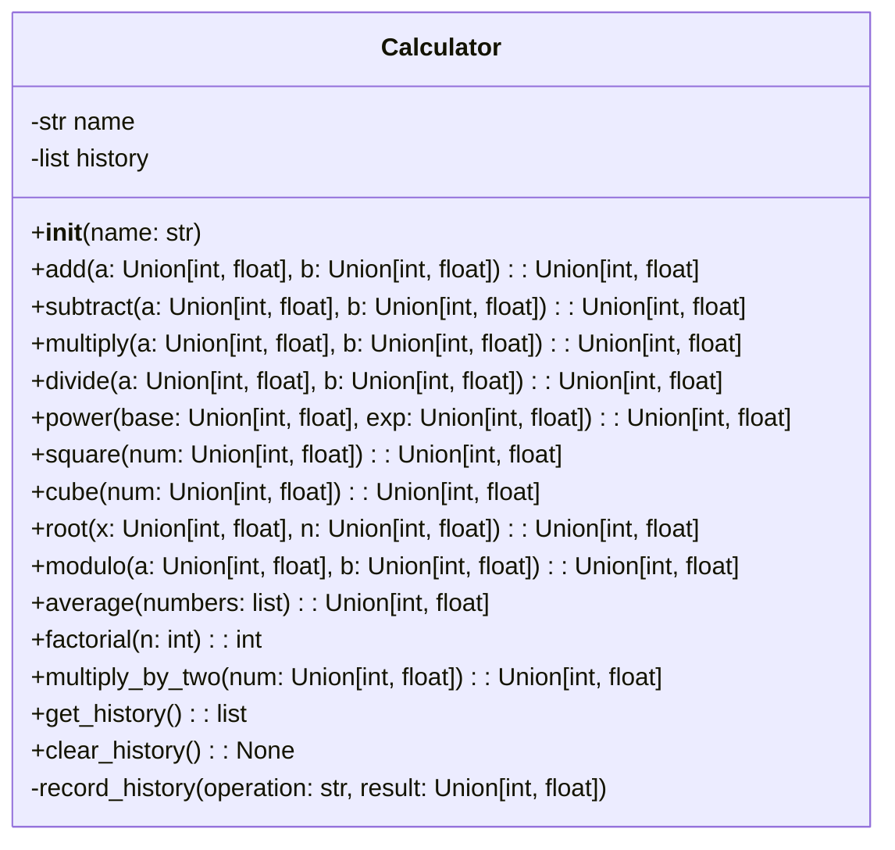
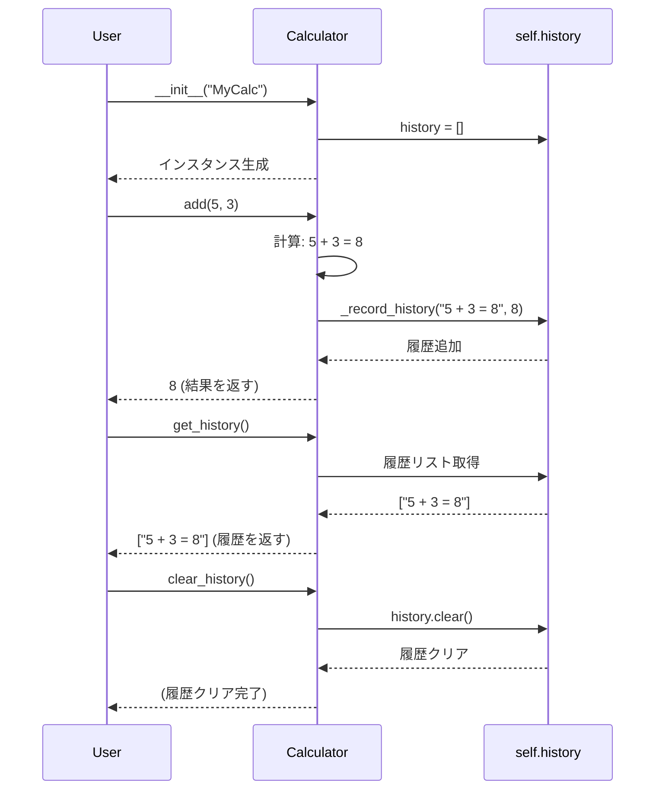

# test_sample 詳細設計書

## 1. 概要

### システム概要
本システムは、基本的な数値計算機能と、その計算履歴を管理する機能を提供する単一モジュールで構成された計算機システムです。ユーザーは様々な算術演算を実行し、過去の操作履歴を確認・クリアすることができます。

### 対象範囲（ファイル）
- `calculator_module.py` (仮称): システムの全機能を含む単一のPythonモジュール。

### 前提条件・制約事項
- 標準的なPython環境（Python 3.8以上推奨）で動作します。
- 数値計算は整数（int）および浮動小数点数（float）をサポートします。
- 計算履歴はメモリ上に保持され、システム終了時には失われます。永続化機能は含まれません。
- ゼロ除算は`ValueError`として扱われます。

## 2. アーキテクチャ設計

### システム構成図
本システムは、`Calculator`という単一のクラスを中心に構成されます。このクラスが全ての計算機能と履歴管理機能を内包します。



### 処理フロー概要
ユーザーは`Calculator`クラスのインスタンスを生成し、提供される各種計算メソッドを呼び出します。各計算メソッドは、計算を実行した後、その操作と結果を内部の履歴リストに記録します。ユーザーは`get_history`メソッドで履歴を取得し、`clear_history`メソッドで履歴を消去できます。

### 主要コンポーネント間の関係
- `Calculator`クラス: システムの唯一の主要コンポーネントであり、全てのビジネスロジックとデータ（履歴）をカプセル化します。
- 外部ライブラリ: `typing.Union`が型ヒントのために使用されます。

### 関連するファイルや処理・呼び出されるメソッド・呼び出し元のメソッド
- **ファイル**: `calculator_module.py`
- **呼び出されるメソッド**: `Calculator`クラスのパブリックメソッド（例: `add()`, `get_history()`など）。
- **呼び出し元のメソッド**: ユーザーアプリケーションやテストコードから`Calculator`インスタンスのメソッドが直接呼び出されます。
- **内部呼び出し**: 各計算メソッドは、計算結果を履歴に記録するために内部のプライベートメソッド（例: `_record_history`）を呼び出します。

## 3. クラス・メソッド設計

### 3.1 クラス・メソッド一覧表

| クラス名 | 役割 | 主要メソッド | 備考 |
| -------- | ---- | ------------ | ---- |
| Calculator | 数値計算機能と計算履歴管理機能を提供 | `__init__`, `add`, `subtract`, `multiply`, `divide`... | パターン: なし |

### 3.2 クラス・メソッド詳細仕様

#### クラス: `Calculator`

- **クラス概要**:
  数値計算機能と、その計算操作の履歴管理機能を提供するクラスです。インスタンスごとに独立した計算履歴を保持します。将来的に計算機能を追加する際も、このクラスにメソッドを追加するだけで容易に拡張可能です。

- **属性一覧**:
  | 属性名 | 型 | 初期値 | 説明 |
  | ------ | -- | ------ | ---- |
  | `name` | `str` | `None` | 計算機の識別名。インスタンス生成時に設定。 |
  | `history` | `list[str]` | `[]` | 実行された計算操作の履歴を文字列形式で格納するリスト。 |

- **メソッド仕様**:

  ##### `__init__(self, name: str)`
  - **引数**:
    - `name`: `str` - 計算機の名前。
  - **戻り値**: なし
  - **処理概要**:
    - `Calculator`インスタンスを初期化します。
    - `name`属性に引数で渡された名前を設定します。
    - `history`属性を空のリストとして初期化し、計算履歴を格納する準備をします。
  - **例外**: なし

  ##### `add(self, a: Union[int, float], b: Union[int, float]) -> Union[int, float]`
  - **引数**:
    - `a`: `Union[int, float]` - 加算される最初の数値。
    - `b`: `Union[int, float]` - 加算される二番目の数値。
  - **戻り値**: `Union[int, float]` - 加算結果。
  - **処理概要**:
    - `a`と`b`を加算します。
    - 計算式と結果を文字列として整形し、`self.history`に記録します。
  - **例外**: なし

  ##### `subtract(self, a: Union[int, float], b: Union[int, float]) -> Union[int, float]`
  - **引数**:
    - `a`: `Union[int, float]` - 減算される最初の数値。
    - `b`: `Union[int, float]` - 減算される二番目の数値。
  - **戻り値**: `Union[int, float]` - 減算結果。
  - **処理概要**:
    - `a`から`b`を減算します。
    - 計算式と結果を文字列として整形し、`self.history`に記録します。
  - **例外**: なし

  ##### `multiply(self, a: Union[int, float], b: Union[int, float]) -> Union[int, float]`
  - **引数**:
    - `a`: `Union[int, float]` - 乗算される最初の数値。
    - `b`: `Union[int, float]` - 乗算される二番目の数値。
  - **戻り値**: `Union[int, float]` - 乗算結果。
  - **処理概要**:
    - `a`と`b`を乗算します。
    - 計算式と結果を文字列として整形し、`self.history`に記録します。
  - **例外**: なし

  ##### `divide(self, a: Union[int, float], b: Union[int, float]) -> Union[int, float]`
  - **引数**:
    - `a`: `Union[int, float]` - 被除数。
    - `b`: `Union[int, float]` - 除数。
  - **戻り値**: `Union[int, float]` - 除算結果。
  - **処理概要**:
    - `a`を`b`で除算します。
    - `b`が0の場合、`ValueError`を発生させます。
    - 計算式と結果を文字列として整形し、`self.history`に記録します。
  - **例外**:
    - `ValueError`: 除数`b`が0の場合。

  ##### `power(self, base: Union[int, float], exp: Union[int, float]) -> Union[int, float]`
  - **引数**:
    - `base`: `Union[int, float]` - 底。
    - `exp`: `Union[int, float]` - 指数。
  - **戻り値**: `Union[int, float]` - べき乗計算結果。
  - **処理概要**:
    - `base`を`exp`乗します。
    - 計算式と結果を文字列として整形し、`self.history`に記録します。
  - **例外**: なし

  ##### `square(self, num: Union[int, float]) -> Union[int, float]`
  - **引数**:
    - `num`: `Union[int, float]` - 二乗する数値。
  - **戻り値**: `Union[int, float]` - 二乗結果。
  - **処理概要**:
    - `num`を二乗します。
    - 計算式と結果を文字列として整形し、`self.history`に記録します。
  - **例外**: なし

  ##### `cube(self, num: Union[int, float]) -> Union[int, float]`
  - **引数**:
    - `num`: `Union[int, float]` - 三乗する数値。
  - **戻り値**: `Union[int, float]` - 三乗結果。
  - **処理概要**:
    - `num`を三乗します。
    - 計算式と結果を文字列として整形し、`self.history`に記録します。
  - **例外**: なし

  ##### `root(self, x: Union[int, float], n: Union[int, float]) -> Union[int, float]`
  - **引数**:
    - `x`: `Union[int, float]` - 根号内の数値。
    - `n`: `Union[int, float]` - 何乗根かを示す数値。
  - **戻り値**: `Union[int, float]` - n乗根の結果。
  - **処理概要**:
    - `x`の`n`乗根を計算します。
    - 計算式と結果を文字列として整形し、`self.history`に記録します。
  - **例外**: なし

  ##### `modulo(self, a: Union[int, float], b: Union[int, float]) -> Union[int, float]`
  - **引数**:
    - `a`: `Union[int, float]` - 被除数。
    - `b`: `Union[int, float]` - 除数。
  - **戻り値**: `Union[int, float]` - 剰余。
  - **処理概要**:
    - `a`を`b`で割った剰余を計算します。
    - 計算式と結果を文字列として整形し、`self.history`に記録します。
  - **例外**: なし

  ##### `average(self, numbers: list[Union[int, float]]) -> Union[int, float]`
  - **引数**:
    - `numbers`: `list[Union[int, float]]` - 平均を計算する数値のリスト。
  - **戻り値**: `Union[int, float]` - 算術平均。
  - **処理概要**:
    - 与えられた数値リストの算術平均を計算します。
    - 計算式と結果を文字列として整形し、`self.history`に記録します。
  - **例外**:
    - `ValueError`: `numbers`リストが空の場合。

  ##### `factorial(self, n: int) -> int`
  - **引数**:
    - `n`: `int` - 階乗を計算する非負整数。
  - **戻り値**: `int` - 階乗の結果。
  - **処理概要**:
    - 指定された非負整数`n`の階乗（n!）を計算します。
    - `n`が負の場合、`ValueError`を発生させます。
    - 計算式と結果を文字列として整形し、`self.history`に記録します。
  - **例外**:
    - `ValueError`: `n`が負の数の場合。

  ##### `multiply_by_two(self, num: Union[int, float]) -> Union[int, float]`
  - **引数**:
    - `num`: `Union[int, float]` - 2倍にする数値。
  - **戻り値**: `Union[int, float]` - 2倍された結果。
  - **処理概要**:
    - 入力された数値を2倍します。
    - 計算式と結果を文字列として整形し、`self.history`に記録します。
  - **例外**: なし

  ##### `get_history(self) -> list[str]`
  - **引数**: なし
  - **戻り値**: `list[str]` - 計算履歴のリスト。
  - **処理概要**:
    - `self.history`に格納されている計算履歴のリストを返します。
    - 履歴リストは読み取り専用として提供され、外部からの直接的な変更を防ぎます（リストのコピーを返すなど）。
  - **例外**: なし

  ##### `clear_history(self) -> None`
  - **引数**: なし
  - **戻り値**: なし
  - **処理概要**:
    - `self.history`に格納されている全ての計算履歴をクリアします。
  - **例外**: なし

  ##### `_record_history(self, operation: str, result: Union[int, float]) -> None` (プライベートメソッド)
  - **引数**:
    - `operation`: `str` - 実行された計算操作の文字列（例: "2 + 3"）。
    - `result`: `Union[int, float]` - 計算結果。
  - **戻り値**: なし
  - **処理概要**:
    - `operation`と`result`を組み合わせて履歴文字列を作成し、`self.history`リストに追加します。
    - 保守性: 履歴の記録ロジックを一元化することで、将来的に履歴のフォーマット変更や永続化機能の追加が容易になります。
  - **例外**: なし

- **継承・実装関係**:
  - 継承: なし
  - 実装: なし

## 4. インターフェース設計

本システムは、`Calculator`クラスのパブリックメソッドを介して外部とインターフェースします。

### API 仕様
各メソッドのシグネチャがそのままAPI仕様となります。

- `__init__(name: str)`
- `add(a: Union[int, float], b: Union[int, float]) -> Union[int, float]`
- `subtract(a: Union[int, float], b: Union[int, float]) -> Union[int, float]`
- `multiply(a: Union[int, float], b: Union[int, float]) -> Union[int, float]`
- `divide(a: Union[int, float], b: Union[int, float]) -> Union[int, float]`
- `power(base: Union[int, float], exp: Union[int, float]) -> Union[int, float]`
- `square(num: Union[int, float]) -> Union[int, float]`
- `cube(num: Union[int, float]) -> Union[int, float]`
- `root(x: Union[int, float], n: Union[int, float]) -> Union[int, float]`
- `modulo(a: Union[int, float], b: Union[int, float]) -> Union[int, float]`
- `average(numbers: list[Union[int, float]]) -> Union[int, float]`
- `factorial(n: int) -> int`
- `multiply_by_two(num: Union[int, float]) -> Union[int, float]`
- `get_history() -> list[str]`
- `clear_history() -> None`

### 入出力データ形式
- **入力**:
    - 数値: Pythonの`int`または`float`型。
    - リスト: `list[Union[int, float]]` (例: `average`メソッド)。
    - 文字列: `str` (例: `__init__`の`name`引数)。
- **出力**:
    - 数値: Pythonの`int`または`float`型。
    - リスト: `list[str]` (計算履歴)。
    - なし: `None` (履歴クリアなど)。

### エラーレスポンス仕様
- **ゼロ除算**: `divide`メソッドで除数が0の場合、Python標準の`ValueError`を発生させます。
- **不正な入力**: `average`メソッドで空のリストが渡された場合、`ValueError`を発生させます。`factorial`メソッドで負の数が渡された場合、`ValueError`を発生させます。
- これらの例外は、呼び出し元で適切に捕捉・処理されることを想定しています。

## 5. データ設計

### データ構造
本システムで管理される主要なデータは、`Calculator`クラスの`history`属性です。

- **`history`**:
    - **型**: `list[str]`
    - **内容**: 各要素は1つの計算操作とその結果を表す文字列です。
    - **形式**: `"操作式 = 結果"` の形式で記録されます。
        - 例: `"2 + 3 = 5"`, `"10 * 2 = 20.0"`, `"factorial(5) = 120"`
    - **目的**: ユーザーが過去の計算履歴を確認できるようにするため。
    - **保守性・拡張性**: 現在は文字列形式ですが、将来的に履歴の構造をより詳細な辞書型（例: `{"operation": "add", "operands": [2, 3], "result": 5, "timestamp": "..."}`）に変更することで、履歴の検索、フィルタリング、永続化などの高度な機能追加に対応できます。

### データベーステーブル設計
本システムはインメモリで履歴を管理するため、データベーステーブルは使用しません。

### データフロー図
```mermaid
flowchart TD
    A[ユーザー入力] --> B{Calculatorインスタンス};
    B -- メソッド呼び出し(例: add(2,3)) --> C[Calculatorメソッド実行];
    C -- 計算結果 --> D[履歴記録 (_record_history)];
    D --> E[self.history (リスト)];
    E -- 履歴取得 (get_history) --> F[ユーザー出力];
    F -- 履歴クリア (clear_history) --> E;
```

## 6. 処理設計

### 6.1 主要処理フロー

#### シーケンス図での表現
以下は、ユーザーが`Calculator`インスタンスを生成し、加算を実行し、履歴を取得する一連の処理フローです。



#### 処理ステップの詳細説明

1.  **インスタンス生成**:
    *   ユーザーは`Calculator`クラスのコンストラクタ`__init__(name)`を呼び出し、計算機インスタンスを生成します。
    *   インスタンス内部では、`name`属性が設定され、`history`リストが空で初期化されます。

2.  **計算メソッド呼び出し**:
    *   ユーザーは、生成された`Calculator`インスタンスのいずれかの計算メソッド（例: `add()`, `divide()`, `power()`など）を呼び出します。
    *   引数として必要な数値が渡されます。

3.  **計算実行**:
    *   呼び出されたメソッド内で、渡された引数に基づいて実際の計算処理が実行されます。
    *   `divide()`メソッドのように、特定の条件（例: ゼロ除算）でエラーが発生する場合は、適切な例外（`ValueError`）が送出されます。

4.  **履歴記録**:
    *   計算が成功した場合、計算メソッドは内部のプライベートメソッド`_record_history()`を呼び出します。
    *   `_record_history()`は、実行された操作（例: "5 + 3"）と計算結果（例: "8"）を組み合わせて文字列（例: "5 + 3 = 8"）を作成し、`self.history`リストの末尾に追加します。
    *   **保守性・拡張性**: 履歴記録ロジックが`_record_history`にカプセル化されているため、将来的に履歴のフォーマット変更や、ファイル/データベースへの永続化機能を追加する際も、このメソッドの内部を変更するだけで済み、各計算メソッドの変更は不要です。

5.  **結果返却**:
    *   計算メソッドは、計算結果を呼び出し元に返します。

6.  **履歴取得**:
    *   ユーザーは`get_history()`メソッドを呼び出すことで、`self.history`に格納されている全計算履歴のリストを取得できます。
    *   このメソッドは`self.history`のコピーを返すことで、外部からの意図しない履歴の変更を防ぎ、データの整合性を保ちます。

7.  **履歴クリア**:
    *   ユーザーは`clear_history()`メソッドを呼び出すことで、`self.history`リストの内容をすべてクリアし、計算履歴を消去できます。