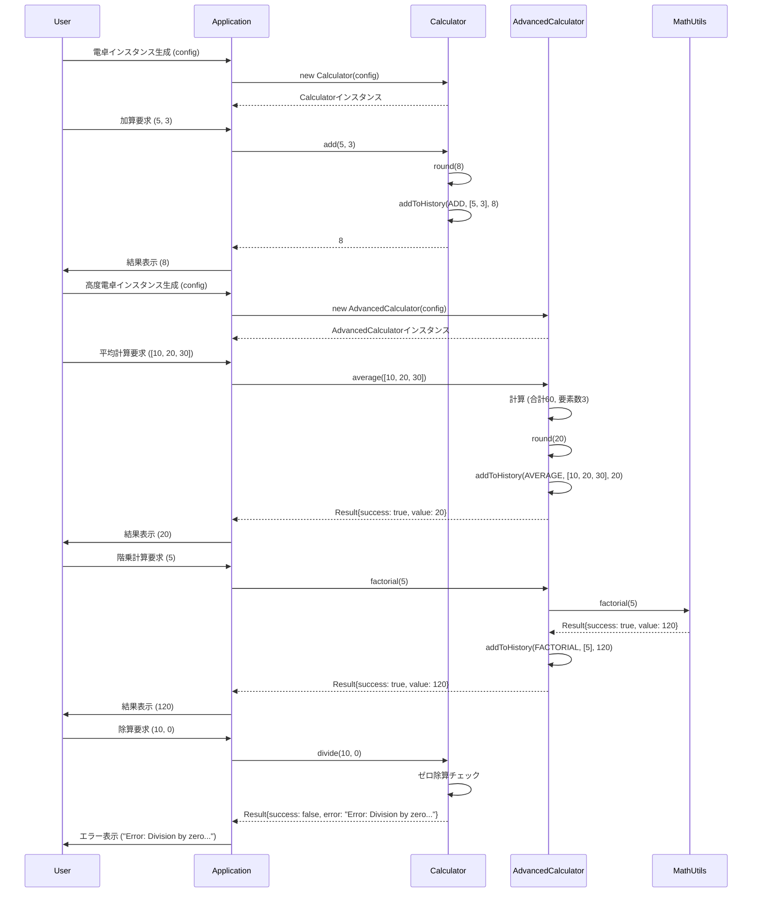

# calculator 詳細設計書

## 1. 概要

### システム概要
本システムは、基本的な算術演算機能から高度な数学的計算、および計算履歴管理機能を提供する電卓システムです。単一のモジュールで構成され、各コンポーネントは明確な責務を持ち、適切に分離された設計となっています。これにより、機能の追加や変更に対する保守性・拡張性を確保しています。

### 対象範囲（ファイル）
*   `Calculator.ts` (または同等のファイル): 基本的な電卓機能、履歴管理
*   `AdvancedCalculator.ts` (または同等のファイル): 高度な電卓機能、基本機能の継承・拡張
*   `MathUtils.ts` (または同等のファイル): 共通数学ユーティリティ機能
*   `types.ts` (または同等のファイル): 型定義 (`CalculatorConfig`, `HistoryEntry`, `OperationType`, `Result`)

### 前提条件・制約事項
*   **技術スタック**: 標準的なJavaScript/TypeScript環境を想定。
*   **数値精度**: `precision` 設定に基づき、計算結果は指定された小数点以下の桁数で四捨五入される。
*   **ゼロ除算**: 除算 (`divide`) においてゼロ除算が発生した場合、エラーとして適切にハンドリングされ、`Result` 型でエラーメッセージが返却される。
*   **階乗計算**: 負の数の階乗はエラーとして処理される。0または1の階乗は1とする。
*   **平均計算**: 空の配列に対する平均計算はエラーとして処理される。
*   **履歴機能**: 履歴機能の有効/無効は設定 (`historyEnabled`) により制御可能。

## 2. アーキテクチャ設計

### システム構成図
```mermaid
classDiagram
    direction LR

    class CalculatorConfig {
        +name: string
        +precision: number
        +historyEnabled: boolean
    }

    class HistoryEntry {
        +timestamp: Date
        +operation: OperationType
        +operands: number[]
        +result: number | string
    }

    class OperationType {
        <<enum>>
        ADD
        SUBTRACT
        MULTIPLY
        DIVIDE
        SQUARE
        POWER
        AVERAGE
        FACTORIAL
        IS_PRIME
        FIBONACCI
        // ... 他の操作
    }

    class Result<T> {
        +success: boolean
        +value?: T
        +error?: string
    }

    class Calculator {
        -name: string
        -precision: number
        -historyEnabled: boolean
        -history: HistoryEntry[]
        +constructor(config: CalculatorConfig)
        +getName(): string
        +round(num: number): number
        +addToHistory(op: OperationType, ops: number[], res: number | string): void
        +add(a: number, b: number): number
        +subtract(a: number, b: number): number
        +multiply(a: number, b: number): number
        +divide(a: number, b: number): Result<number>
        +square(num: number): number
        +power(base: number, exp: number): number
        +getHistory(): HistoryEntry[]
        +clearHistory(): void
        +getHistorySummary(): { total: number, byType: Map<OperationType, number> }
    }

    class AdvancedCalculator {
        +constructor(config: CalculatorConfig)
        +average(numbers: number[]): Result<number>
        +factorial(n: number): Result<number>
        +isPrime(n: number): boolean
        +fibonacciSequence(length: number): number[]
    }

    class MathUtils {
        +factorial(n: number): Result<number>
        +isPrime(n: number): boolean
        +fibonacciSequence(length: number): number[]
    }

    CalculatorConfig --o Calculator : uses
    HistoryEntry --o Calculator : stores
    OperationType --o HistoryEntry : uses
    Result --o Calculator : returns
    Result --o AdvancedCalculator : returns

    AdvancedCalculator --|> Calculator : inherits
    AdvancedCalculator ..> MathUtils : uses (for specific ops)
```

### 処理フロー概要
ユーザーからの計算要求は、`Calculator` または `AdvancedCalculator` インスタンスの対応するメソッドによって処理されます。各計算メソッドは、入力値の検証、計算実行、結果の丸め処理、そして計算履歴への記録を行います。特にエラーが発生しうる操作（例: ゼロ除算、負の階乗）では、`Result` 型を用いて成功/失敗と結果/エラーメッセージを明確に返却します。履歴機能が有効な場合、すべての計算操作はタイムスタンプ、操作種別、オペランド、結果と共に内部の履歴リストに保存されます。

### 主要コンポーネント間の関係
*   **`Calculator`**: システムの基盤となる電卓機能を提供します。基本的な四則演算、べき乗、2乗、および計算履歴の管理（追加、取得、クリア、サマリー）を担当します。
*   **`AdvancedCalculator`**: `Calculator` を継承し、その機能を拡張します。平均計算、階乗、素数判定、フィボナッチ数列生成といった高度な数学的計算機能を追加で提供します。基本機能は親クラスのものを利用し、必要に応じてオーバーライドまたは拡張します。
*   **`MathUtils`**: `AdvancedCalculator` から利用される可能性のある、汎用的な数学的ユーティリティ機能（階乗、素数判定、フィボナッチ数列）を提供します。これにより、数学ロジックが独立し、再利用性と保守性が向上します。
*   **型定義 (`CalculatorConfig`, `HistoryEntry`, `OperationType`, `Result`)**: 各コンポーネント間でデータの構造と振る舞いを明確にするための共通インターフェースを提供します。これにより、型安全性が確保され、開発効率とコード品質が向上します。

### 関連するファイルや処理・呼び出されるメソッド・呼び出し元のメソッド
*   **`Calculator` クラス**:
    *   `constructor`: `CalculatorConfig` を受け取り、`name`, `precision`, `historyEnabled`, `history` 属性を初期化します。
    *   `add`, `subtract`, `multiply`, `square`, `power`: 内部で `this.round()` を呼び出し結果を丸め、`this.addToHistory()` を呼び出し履歴を記録します。
    *   `divide`: ゼロ除算チェックを行い、`Result<number>` を返します。成功時は `this.round()` と `this.addToHistory()` を呼び出します。
    *   `getHistorySummary`: `history` 属性を走査し、集計を行います。
*   **`AdvancedCalculator` クラス**:
    *   `constructor`: `super(config)` を呼び出し、親クラスの初期化を行います。
    *   `average`: 配列の合計に `Array.prototype.reduce` を利用し、空配列チェックを行い `Result<number>` を返します。
    *   `factorial`, `isPrime`, `fibonacciSequence`: `MathUtils` クラスの対応する静的メソッド（またはインスタンスメソッド）を呼び出すことで、処理を委譲します。これにより、数学的ロジックの分離と再利用が促進されます。
*   **`MathUtils` クラス**:
    *   `factorial`, `isPrime`, `fibonacciSequence`: 独立した数学的計算ロジックを提供します。`AdvancedCalculator` から呼び出されます。

## 3. クラス・メソッド設計

### 3.1 クラス・メソッド一覧表

| クラス名           | 役割                                   | 主要メソッド                                | 備考                                     |
| ------------------ | -------------------------------------- | ------------------------------------------- | ---------------------------------------- |
| Calculator         | 基本算術演算と履歴管理                 | constructor, add, subtract, multiply...     | 基底クラス                               |
| AdvancedCalculator | 高度な計算機能と履歴管理の拡張         | constructor, average, factorial...          | Calculatorを継承                         |
| MathUtils          | 汎用的な数学的ユーティリティ           | factorial, isPrime, fibonacciSequence       | 独立したユーティリティ                   |
| CalculatorConfig   | 電卓の初期設定値の型定義               | (属性のみ)                                  | 内部型定義                               |
| HistoryEntry       | 計算履歴エントリの型定義               | (属性のみ)                                  | 内部型定義                               |
| OperationType      | 計算操作の種類を識別する列挙型         | (列挙値のみ)                                | 内部型定義                               |
| Result             | 操作の成功/失敗と結果/エラーを表現     | (属性のみ)                                  | 汎用的な戻り値型                         |

### 3.2 クラス・メソッド詳細仕様

#### クラス: `Calculator`

*   **クラス概要**:
    基本的な算術演算（加算、減算、乗算、除算、2乗、べき乗）と、計算履歴の管理機能を提供します。設定値に基づいて数値の丸め処理や履歴記録の有効/無効を制御します。本システムの基底となるクラスであり、拡張性のため `AdvancedCalculator` クラスに継承されます。

*   **属性一覧**:
    | 属性名          | 型               | 初期値      | 説明                                                              |
    | --------------- | ---------------- | ----------- | ----------------------------------------------------------------- |
    | `name`          | `string`         | `config.name` | 電卓インスタンスの識別名                                          |
    | `precision`     | `number`         | `config.precision` | 計算結果を丸める小数点以下の桁数                                  |
    | `historyEnabled`| `boolean`        | `config.historyEnabled` | 計算履歴を記録するかどうかのフラグ                                |
    | `history`       | `HistoryEntry[]` | `[]`        | 実行された計算操作の履歴リスト                                    |

*   **メソッド仕様**:

    *   **`constructor(config: CalculatorConfig)`**
        *   **引数**:
            *   `config`: `CalculatorConfig` - 電卓の初期設定オブジェクト。
        *   **戻り値**: なし
        *   **処理概要**:
            `Calculator` インスタンスを初期化し、`config` オブジェクトから `name`, `precision`, `historyEnabled` 属性を設定します。`history` リストは空の配列で初期化されます。
        *   **例外**: なし

    *   **`add(a: number, b: number): number`**
        *   **引数**:
            *   `a`: `number` - 加算される最初の数値。
            *   `b`: `number` - 加算される2番目の数値。
        *   **戻り値**: `number` - 丸め処理が適用された加算結果。
        *   **処理概要**:
            `a` と `b` を加算し、結果を `this.round()` メソッドで丸めます。その後、`OperationType.ADD` として操作内容、オペランド、結果を `this.addToHistory()` メソッドで履歴に記録します。
        *   **例外**: なし

    *   **`divide(a: number, b: number): Result<number>`**
        *   **引数**:
            *   `a`: `number` - 被除数。
            *   `b`: `number` - 除数。
        *   **戻り値**: `Result<number>` - 除算結果、またはエラーメッセージを含むオブジェクト。
        *   **処理概要**:
            `b` が `0` の場合、ゼロ除算エラーとして `Result` オブジェクトにエラーメッセージを設定して返します。それ以外の場合、`a` を `b` で除算し、結果を `this.round()` で丸めます。`OperationType.DIVIDE` として操作内容、オペランド、結果を `this.addToHistory()` で履歴に記録し、成功を示す `Result` オブジェクトを返します。
        *   **例外**: ゼロ除算時に `Result` オブジェクトでエラーを通知。

    *   **`addToHistory(operation: OperationType, operands: number[], result: number | string): void`**
        *   **引数**:
            *   `operation`: `OperationType` - 実行された操作の種類。
            *   `operands`: `number[]` - 操作に使用された数値の配列。
            *   `result`: `number | string` - 操作の結果。
        *   **戻り値**: なし
        *   **処理概要**:
            `this.historyEnabled` が `true` の場合、現在のタイムスタンプ、`operation`、`operands`、`result` を含む `HistoryEntry` オブジェクトを作成し、`this.history` リストの末尾に追加します。
        *   **例外**: なし

*   **継承・実装関係**:
    *   `AdvancedCalculator` クラスによって継承されます。

#### クラス: `AdvancedCalculator`

*   **クラス概要**:
    `Calculator` クラスの機能を継承し、さらに高度な数学的計算機能（平均、階乗、素数判定、フィボナッチ数列）を提供します。これにより、基本機能と拡張機能の分離が図られ、保守性と拡張性が向上します。

*   **属性一覧**:
    *   `Calculator` クラスの属性を継承。

*   **メソッド仕様**:

    *   **`constructor(config: CalculatorConfig)`**
        *   **引数**:
            *   `config`: `CalculatorConfig` - 電卓の初期設定オブジェクト。
        *   **戻り値**: なし
        *   **処理概要**:
            親クラス `Calculator` のコンストラクタを呼び出し、基本的な電卓機能を初期化します。
        *   **例外**: なし

    *   **`average(numbers: number[]): Result<number>`**
        *   **引数**:
            *   `numbers`: `number[]` - 平均を計算する数値の配列。
        *   **戻り値**: `Result<number>` - 平均値、またはエラーメッセージを含むオブジェクト。
        *   **処理概要**:
            `numbers` 配列が空の場合、エラーとして `Result` オブジェクトにエラーメッセージを設定して返します。それ以外の場合、配列内の数値の合計を計算し、要素数で割って平均値を求めます。結果を `this.round()` で丸め、`OperationType.AVERAGE` として履歴に記録し、成功を示す `Result` オブジェクトを返します。
        *   **例外**: 空の配列が渡された場合に `Result` オブジェクトでエラーを通知。

    *   **`factorial(n: number): Result<number>`**
        *   **引数**:
            *   `n`: `number` - 階乗を計算する非負整数。
        *   **戻り値**: `Result<number>` - 階乗の結果、またはエラーメッセージを含むオブジェクト。
        *   **処理概要**:
            `n` が負の数の場合、エラーとして `Result` オブジェクトにエラーメッセージを設定して返します。`n` が `0` または `1` の場合、`1` を返します。それ以外の場合、`MathUtils.factorial()` を呼び出して階乗を計算し、結果を `OperationType.FACTORIAL` として履歴に記録し、成功を示す `Result` オブジェクトを返します。
        *   **例外**: 負の数が渡された場合に `Result` オブジェクトでエラーを通知。

*   **継承・実装関係**:
    *   `Calculator` クラスを継承します。

#### クラス: `MathUtils`

*   **クラス概要**:
    電卓機能から独立した、汎用的な数学的ユーティリティ機能（階乗、素数判定、フィボナッチ数列生成）を提供します。これらの機能は `AdvancedCalculator` クラスから利用されますが、独立したクラスとして定義することで、再利用性と保守性を高めています。

*   **属性一覧**: なし (静的メソッドのみ、またはインスタンス化不要)

*   **メソッド仕様**:

    *   **`factorial(n: number): Result<number>`**
        *   **引数**:
            *   `n`: `number` - 階乗を計算する非負整数。
        *   **戻り値**: `Result<number>` - 階乗の結果、またはエラーメッセージを含むオブジェクト。
        *   **処理概要**:
            `n` が負の数の場合、エラーとして `Result` オブジェクトにエラーメッセージを設定して返します。`n` が `0` または `1` の場合、`1` を返します。それ以外の場合、再帰またはループを用いて階乗を計算し、成功を示す `Result` オブジェクトを返します。
        *   **例外**: 負の数が渡された場合に `Result` オブジェクトでエラーを通知。

    *   **`isPrime(n: number): boolean`**
        *   **引数**:
            *   `n`: `number` - 素数判定を行う数値。
        *   **戻り値**: `boolean` - `n` が素数であれば `true`、そうでなければ `false`。
        *   **処理概要**:
            `n` が `2` 未満の場合、`false` を返します。`n` が `2` の場合、`true` を返します。`n` が偶数の場合、`false` を返します。それ以外の場合、`3` から `sqrt(n)` までの奇数で割り切れるかを確認し、素数判定を行います。
        *   **例外**: なし

*   **継承・実装関係**: なし

## 4. インターフェース設計

### API 仕様
本システムは、クラスのパブリックメソッドを通じて機能を提供します。

*   **`Calculator` クラス**:
    *   `new Calculator(config: CalculatorConfig)`: 電卓インスタンスを生成。
    *   `getName(): string`: 電卓名を取得。
    *   `add(a: number, b: number): number`: 加算。
    *   `subtract(a: number, b: number): number`: 減算。
    *   `multiply(a: number, b: number): number`: 乗算。
    *   `divide(a: number, b: number): Result<number>`: 除算。
    *   `square(num: number): number`: 2乗。
    *   `power(base: number, exp: number): number`: べき乗。
    *   `getHistory(): HistoryEntry[]`: 計算履歴を取得。
    *   `clearHistory(): void`: 計算履歴をクリア。
    *   `getHistorySummary(): { total: number, byType: Map<OperationType, number> }`: 履歴サマリーを取得。

*   **`AdvancedCalculator` クラス**:
    *   `new AdvancedCalculator(config: CalculatorConfig)`: 高度電卓インスタンスを生成。
    *   `average(numbers: number[]): Result<number>`: 数値配列の平均を計算。
    *   `factorial(n: number): Result<number>`: 階乗を計算。
    *   `isPrime(n: number): boolean`: 素数判定。
    *   `fibonacciSequence(length: number): number[]`: フィボナッチ数列を生成。

*   **`MathUtils` クラス**:
    *   `MathUtils.factorial(n: number): Result<number>`: 階乗を計算 (静的メソッドとして利用を推奨)。
    *   `MathUtils.isPrime(n: number): boolean`: 素数判定 (静的メソッドとして利用を推奨)。
    *   `MathUtils.fibonacciSequence(length: number): number[]`: フィボナッチ数列を生成 (静的メソッドとして利用を推奨)。

### 入出力データ形式

*   **`CalculatorConfig`**:
    ```typescript
    interface CalculatorConfig {
        name: string;
        precision: number; // 小数点以下の桁数
        historyEnabled: boolean; // 履歴記録の有効/無効
    }
    ```

*   **`HistoryEntry`**:
    ```typescript
    interface HistoryEntry {
        timestamp: Date;
        operation: OperationType;
        operands: number[];
        result: number | string; // エラーメッセージの場合にstring
    }
    ```

*   **`OperationType`**:
    ```typescript
    enum OperationType {
        ADD = "ADD",
        SUBTRACT = "SUBTRACT",
        MULTIPLY = "MULTIPLY",
        DIVIDE = "DIVIDE",
        SQUARE = "SQUARE",
        POWER = "POWER",
        AVERAGE = "AVERAGE",
        FACTORIAL = "FACTORIAL",
        IS_PRIME = "IS_PRIME",
        FIBONACCI = "FIBONACCI",
        // ... 他の操作タイプ
    }
    ```

*   **`Result<T>`**:
    ```typescript
    interface Result<T> {
        success: boolean; // 処理が成功したか
        value?: T;       // 成功時の結果値
        error?: string;  // 失敗時のエラーメッセージ
    }
    ```

### エラーレスポンス仕様
エラーが発生する可能性のあるメソッド（例: `divide`, `average`, `factorial`）は、`Result<T>` 型を返します。
*   **成功時**: `success: true`, `value: T` (結果値)
*   **失敗時**: `success: false`, `error: string` (エラーメッセージ)

**例**:
*   ゼロ除算: `{ success: false, error: "Error: Division by zero is not allowed." }`
*   空配列の平均: `{ success: false, error: "Error: Cannot calculate average of an empty array." }`
*   負の数の階乗: `{ success: false, error: "Error: Factorial is not defined for negative numbers." }`

## 5. データ設計

### データ構造
本システムで扱う主要なデータ構造は以下の通りです。これらはTypeScriptのインターフェースやEnumとして定義され、型安全なデータ管理を実現します。

*   **`CalculatorConfig`**: 電卓の初期設定を保持するオブジェクト。
    *   `name`: `string` - 電卓の表示名。
    *   `precision`: `number` - 計算結果の丸め精度（小数点以下の桁数）。
    *   `historyEnabled`: `boolean` - 計算履歴の記録を有効にするか否か。

*   **`HistoryEntry`**: 各計算操作の履歴を記録するオブジェクト。
    *   `timestamp`: `Date` - 操作が実行された日時。
    *   `operation`: `OperationType` - 実行された操作の種類（例: `ADD`, `DIVIDE`）。
    *   `operands`: `number[]` - 操作に使用された入力数値の配列。
    *   `result`: `number | string` - 操作の計算結果。エラーの場合はエラーメッセージ文字列。

*   **`OperationType`**: 実行可能な計算操作の種類を定義する列挙型。
    *   `ADD`, `SUBTRACT`, `MULTIPLY`, `DIVIDE`, `SQUARE`, `POWER`, `AVERAGE`, `FACTORIAL`, `IS_PRIME`, `FIBONACCI` など。

*   **`Result<T>`**: 処理の成功/失敗とその結果またはエラー情報をカプセル化する汎用型。
    *   `success`: `boolean` - 処理が成功したか否か。
    *   `value?: T` - 処理成功時の結果値。
    *   `error?: string` - 処理失敗時のエラーメッセージ。

### データベーステーブル設計（該当する場合）
本システムはインメモリで計算履歴を管理するため、永続化のためのデータベーステーブルは**該当しません**。
将来的に履歴の永続化が必要になった場合は、`HistoryEntry` 構造を基にRDBMSのテーブル（例: `calculations_history`）やNoSQLのドキュメント構造を設計します。

### データフロー図
```mermaid
flowchart TD
    A[ユーザー入力] --> B{Calculator / AdvancedCalculator};
    B -- 数値, 操作タイプ --> C[計算ロジック];
    C -- 計算結果 --> D{結果の丸め};
    D -- 丸められた結果 --> E{履歴記録};
    E -- HistoryEntry --> F[履歴リスト (history)];
    F -- 履歴取得要求 --> G[履歴サマリー / 全履歴];
    G --> H[ユーザー出力];

    B -- エラー発生 --> I[エラーハンドリング (Result型)];
    I --> H;
```

## 6. 処理設計

### 6.1 主要処理フロー

#### シーケンス図での表現
基本的な加算処理と履歴記録のシーケンス、および高度な平均計算のシーケンスを示します。



### 処理ステップの詳細説明

1.  **インスタンス生成**:
    *   アプリケーションは、`CalculatorConfig` オブジェクトを渡して `Calculator` または `AdvancedCalculator` のインスタンスを生成します。
    *   コンストラクタは、設定値（名前、精度、履歴有効/無効）と空の履歴リストでインスタンスを初期化します。

2.  **計算要求の受付**:
    *   ユーザーからの計算要求（例: `add(5, 3)`、`average([10, 20, 30])`）をアプリケーションが受け付け、対応する電卓インスタンスのメソッドを呼び出します。

3.  **計算ロジックの実行**:
    *   各計算メソッドは、与えられた引数に基づいて算術演算を実行します。
    *   `divide` や `factorial`、`average` などのエラーが発生しうるメソッドでは、入力値の検証（例: ゼロ除算、負の数、空配列）が行われます。
    *   `AdvancedCalculator` の高度な数学関数（`factorial`, `isPrime`, `fibonacciSequence`）は、`MathUtils` クラスの対応するメソッドに処理を委譲します。

4.  **結果の丸め処理**:
    *   計算結果は、`Calculator` クラスの `precision` 属性に基づいて `round()` メソッドによって四捨五入されます。これにより、数値精度の一貫性が保たれます。

5.  **履歴記録**:
    *   `historyEnabled` が `true` の場合、計算が成功すると、`addToHistory()` メソッドが呼び出されます。
    *   `addToHistory()` は、現在のタイムスタンプ、操作の種類 (`OperationType`)、使用されたオペランド、計算結果を含む `HistoryEntry` オブジェクトを作成し、内部の `history` リストに追加します。

6.  **結果の返却とエラーハンドリング**:
    *   成功した計算は、丸められた数値結果を直接返します（例: `add`）。
    *   エラーが発生する可能性のある計算（例: `divide`, `average`, `factorial`）は、`Result<T>` 型のオブジェクトを返します。
        *   成功時は `Result.success` が `true` となり、`Result.value` に結果が格納されます。
        *   失敗時は `Result.success` が `false` となり、`Result.error` にエラーメッセージが格納されます。
    *   アプリケーションは返された `Result` オブジェクトをチェックし、成功/失敗に応じて結果表示またはエラーメッセージ表示を行います。

7.  **履歴の取得とサマリー**:
    *   `getHistory()` メソッドは、記録された全履歴のシャローコピーを返します。
    *   `getHistorySummary()` メソッドは、履歴リストを走査し、総操作回数と操作種別ごとの実行回数を集計したサマリーオブジェクトを返します。

**保守性・拡張性の観点**:
*   **責務の分離**: `Calculator` (基本機能), `AdvancedCalculator` (拡張機能), `MathUtils` (ユーティリティ) とクラスの責務が明確に分離されているため、特定の機能の変更が他の部分に与える影響が最小限に抑えられます。
*   **継承の利用**: `AdvancedCalculator` が `Calculator` を継承することで、基本機能を再利用しつつ、新しい機能を追加・拡張できます。これにより、コードの重複を避け、一貫性を保ちやすくなります。
*   **型定義の活用**: `CalculatorConfig`, `HistoryEntry`, `OperationType`, `Result` といった明確な型定義を導入することで、コードの可読性、保守性、および型安全性が向上します。コンパイル時にエラーを検出しやすくなり、実行時エラーのリスクが低減します。
*   **エラーハンドリングの一貫性**: `Result<T>` 型を用いることで、エラーを返すメソッドのインターフェースが一貫し、呼び出し側でのエラー処理が標準化されます。これにより、堅牢なアプリケーション構築が容易になります。
*   **履歴機能の分離**: `addToHistory` メソッドを独立させることで、計算ロジックと履歴記録の関心事を分離しています。履歴記録の有効/無効設定も容易です。
*   **ユーティリティの独立**: `MathUtils` を独立したクラスとすることで、数学的アルゴリズムが電卓のロジックから分離され、他のプロジェクトやモジュールでの再利用が容易になります。