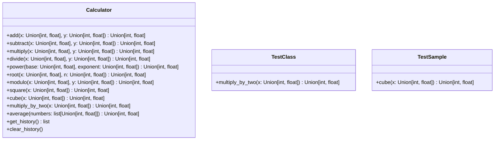
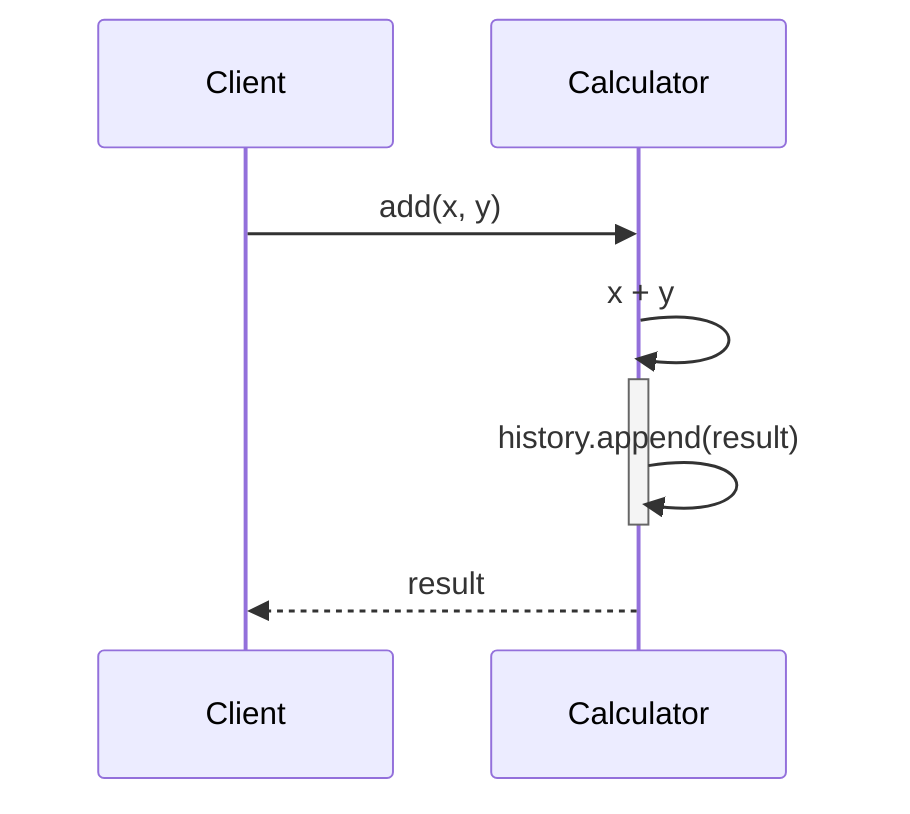

# test_sample 詳細設計書

## 1. 概要

- システム概要: 数値計算機能と計算履歴管理機能を提供するモジュール。
- 対象範囲（ファイル）: test_sample.py (仮定)
- 前提条件・制約事項: Python 3.7 以降がインストールされていること。標準ライブラリのみを使用。

## 2. アーキテクチャ設計

- システム構成図:



- 処理フロー概要: 各計算メソッドは、計算を行い、結果を返し、計算履歴に記録する。`get_history`メソッドで履歴を取得できる。
- 主要コンポーネント間の関係: `Calculator`クラスが中心となり、各種計算メソッドを提供する。`TestClass`と`TestSample`は、特定の計算メソッドを使用する例。
- 関連するファイルや処理・呼び出されるメソッド・呼び出し元のメソッド:
    - ファイル: test_sample.py
    - 処理: 数値計算、履歴管理
    - 呼び出されるメソッド: 各計算メソッド (add, subtract, etc.)
    - 呼び出し元のメソッド: テストコード、他のモジュール (import して使用)

## 3. クラス・メソッド設計

### 3.1 クラス・メソッド一覧表

| クラス名 | 役割 | 主要メソッド | 備考 |
| -------- | ---- | ------------ | ---- |
| Calculator | 数値計算機能と履歴管理 | add, subtract, multiply... |  |
| TestClass | 数値計算と履歴管理 | multiply_by_two |  |
| TestSample | 数値計算と履歴管理 | cube |  |

### 3.2 クラス・メソッド詳細仕様

#### Calculator クラス

- クラス概要: 基本的な数値計算機能と計算履歴管理機能を提供するクラス。
- 属性一覧:
    - `history`: `list` = `[]` (計算履歴を格納するリスト)
- メソッド仕様:
    - `__init__`:
        - 引数: なし
        - 戻り値: なし
        - 処理概要: `history`リストを初期化する。
        - 例外: なし
    - `add(x: Union[int, float], y: Union[int, float]) -> Union[int, float]`:
        - 引数: `x` (数値), `y` (数値)
        - 戻り値: `x + y` (数値)
        - 処理概要: `x`と`y`を加算し、結果を`history`に追加して返す。
        - 例外: なし
    - `subtract(x: Union[int, float], y: Union[int, float]) -> Union[int, float]`:
        - 引数: `x` (数値), `y` (数値)
        - 戻り値: `x - y` (数値)
        - 処理概要: `x`から`y`を減算し、結果を`history`に追加して返す。
        - 例外: なし
    - `multiply(x: Union[int, float], y: Union[int, float]) -> Union[int, float]`:
        - 引数: `x` (数値), `y` (数値)
        - 戻り値: `x * y` (数値)
        - 処理概要: `x`と`y`を乗算し、結果を`history`に追加して返す。
        - 例外: なし
    - `divide(x: Union[int, float], y: Union[int, float]) -> Union[int, float]`:
        - 引数: `x` (数値), `y` (数値)
        - 戻り値: `x / y` (数値)
        - 処理概要: `x`を`y`で除算し、結果を`history`に追加して返す。
        - 例外: `ZeroDivisionError` (y が 0 の場合)
    - `power(base: Union[int, float], exponent: Union[int, float]) -> Union[int, float]`:
        - 引数: `base` (底), `exponent` (指数)
        - 戻り値: `base ** exponent` (数値)
        - 処理概要: `base`の`exponent`乗を計算し、結果を`history`に追加して返す。
        - 例外: なし
    - `root(x: Union[int, float], n: Union[int, float]) -> Union[int, float]`:
        - 引数: `x` (数値), `n` (根指数)
        - 戻り値: `x ** (1/n)` (数値)
        - 処理概要: `x`の`n`乗根を計算し、結果を`history`に追加して返す。
        - 例外: なし
    - `modulo(x: Union[int, float], y: Union[int, float]) -> Union[int, float]`:
        - 引数: `x` (数値), `y` (数値)
        - 戻り値: `x % y` (数値)
        - 処理概要: `x`を`y`で割った余りを計算し、結果を`history`に追加して返す。
        - 例外: なし
    - `square(x: Union[int, float]) -> Union[int, float]`:
        - 引数: `x` (数値)
        - 戻り値: `x ** 2` (数値)
        - 処理概要: `x`の2乗を計算し、結果を`history`に追加して返す。
        - 例外: なし
    - `cube(x: Union[int, float]) -> Union[int, float]`:
        - 引数: `x` (数値)
        - 戻り値: `x ** 3` (数値)
        - 処理概要: `x`の3乗を計算し、結果を`history`に追加して返す。
        - 例外: なし
    - `multiply_by_two(x: Union[int, float]) -> Union[int, float]`:
        - 引数: `x` (数値)
        - 戻り値: `x * 2` (数値)
        - 処理概要: `x`を2倍し、結果を`history`に追加して返す。
        - 例外: なし
    - `average(numbers: list[Union[int, float]]) -> Union[int, float]`:
        - 引数: `numbers` (数値のリスト)
        - 戻り値: リストの平均値 (数値)
        - 処理概要: `numbers`リストの平均値を計算し、結果を`history`に追加して返す。
        - 例外: `TypeError` (リストの要素が数値でない場合), `ZeroDivisionError` (リストが空の場合)
    - `get_history() -> list`:
        - 引数: なし
        - 戻り値: `history` (リスト)
        - 処理概要: 計算履歴のコピーを返す。
        - 例外: なし
    - `clear_history()`:
        - 引数: なし
        - 戻り値: なし
        - 処理概要: 計算履歴をクリアする。
        - 例外: なし
- 継承・実装関係: なし

#### TestClass クラス

- クラス概要: `multiply_by_two`メソッドを持つテストクラス。
- 属性一覧: なし
- メソッド仕様:
    - `multiply_by_two(x: Union[int, float]) -> Union[int, float]`:
        - 引数: `x` (数値)
        - 戻り値: `x * 2` (数値)
        - 処理概要: `x`を2倍して返す。`Calculator`クラスのインスタンスが存在する場合、履歴に追加する。
        - 例外: なし
- 継承・実装関係: なし

#### TestSample クラス

- クラス概要: `cube`メソッドを持つテストクラス。
- 属性一覧: なし
- メソッド仕様:
    - `cube(x: Union[int, float]) -> Union[int, float]`:
        - 引数: `x` (数値)
        - 戻り値: `x ** 3` (数値)
        - 処理概要: `x`の3乗を計算して返す。`Calculator`クラスのインスタンスが存在する場合、履歴に追加する。
        - 例外: なし
- 継承・実装関係: なし

## 4. インターフェース設計

- API 仕様: このモジュールはクラスとして提供され、APIは各クラスのメソッドとして提供される。
- 入出力データ形式:
    - 入力: `int` または `float` 型の数値、数値のリスト
    - 出力: `int` または `float` 型の数値、計算履歴のリスト
- エラーレスポンス仕様:
    - `ZeroDivisionError`: 0 で除算した場合に発生。
    - `TypeError`: 引数の型が不正な場合に発生。

## 5. データ設計

- データ構造:
    - `history`: 計算結果を格納するリスト。各要素は計算結果の数値 (`int` または `float`)。
- データベーステーブル設計: 該当なし
- データフロー図:

```mermaid
flowchart TD
    A[入力 (数値)] --> B(Calculator クラスのメソッド);
    B --> C{計算処理};
    C --> D[出力 (数値)];
    C --> E[history リスト];
    E --> F(get_history メソッド);
    F --> G[出力 (履歴リスト)];
```

## 6. 処理設計

### 6.1 主要処理フロー

- シーケンス図:



- 処理ステップの詳細説明:
    1. クライアントが `Calculator` クラスの `add` メソッドを呼び出す。引数として数値 `x` と `y` を渡す。
    2. `Calculator` クラス内で `x + y` の計算が行われる。
    3. 計算結果が `history` リストに追加される。
    4. 計算結果がクライアントに返される。

**保守性・拡張性の観点:**

- 各計算メソッドは独立しており、追加や修正が容易。
- `history`リストは計算履歴を保持するため、デバッグや監査に役立つ。
- 型ヒントを使用することで、コードの可読性と保守性を向上させている。
- 必要に応じて、より複雑な計算機能や統計処理機能を追加できる。
- エラーハンドリングを適切に行うことで、システムの安定性を高める。