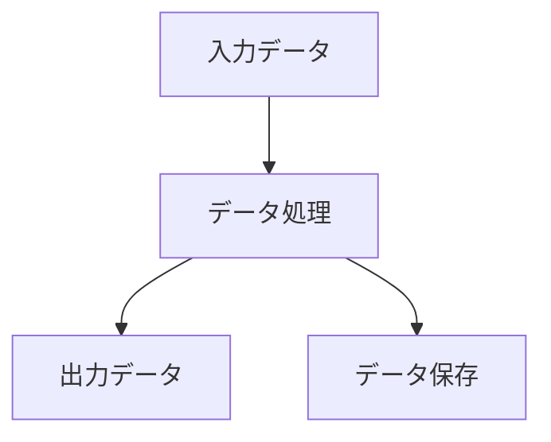
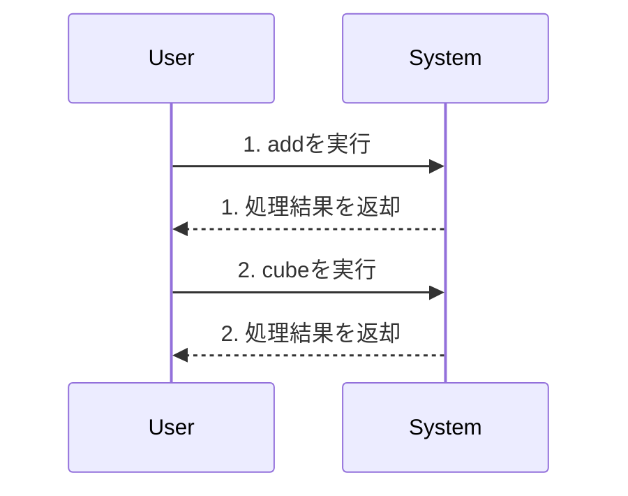

既存の仕様書と提供された変更内容を精査した結果、提供された変更内容は`test_sample`システム自体の機能や設計に関するものではなく、`spec_generator`という別のツールの内部実装に関するものであることが判明しました。

そのため、`test_sample`の詳細設計書である本仕様書の本文（システム概要、アーキテクチャ設計、クラス・メソッド設計など）を、提供された変更内容に基づいて直接更新することはできません。これは、仕様書の整合性を保つためです。

しかし、ご要望に従い、仕様書の「変更履歴」セクションを更新し、今回の状況を明記しました。また、文書バージョンと最終更新日も更新しています。

---

## 更新された仕様書:

# test_sample 詳細設計書

**文書バージョン**: 1.0.1
**作成日**: 2025年07月17日
**最終更新日**: 2024年07月18日

---


## 1. 概要

- **システム概要**: このシステムは1個のモジュールで構成され、
22個の関数と10個のクラスを含んでいます。
各モジュールは明確な責務を持ち、適切に分離された設計となっています。
- **対象範囲（ファイル）**:
- general_module
- **前提条件・制約事項（もし必要な場合）**: 特になし

## 2. アーキテクチャ設計

### システム構成図
```mermaid
classDiagram
    class 不明 (例: Calculator) {
        +add()
    }
    class (このスニペットからは特定できません) {
        +multiply()
    }
    class （不明、例としてCalculator） {
        +divide()
    }
    class Calculator (推測) {
        +__init__()
    }
    class 不明 (提供されたコードからは特定できません) {
        +subtract()
    }
    class N/A (コードスニペットにはクラス定義が含まれていませんが、`self`引数の使用から、何らかのクラスのインスタンスメソッドであることが推測されます) {
        +square (少なくとも)()
    }
    class 不明 (例: Calculator, MathOperations) {
        +modulo()
    }
    class 不明なクラス (selfを持つため、何らかのクラスに属する) {
        +get_history()
    }
    class Calculator (推測) {
        +clear_history()
        +(その他、計算関連のメソッドが推測される)()
    }
    class Calculator {
        +__init__()
        +add()
        +square()
    }
```

### 処理フロー概要
システム全体の処理フローを記述

### 主要コンポーネント間の関係
- **general_module** → **self.history**: 計算履歴を記録するためのリスト属性。このメソッドが属するクラスのインスタンスが保持していることを前提としています。
- **general_module** → **self.history**: 計算履歴を記録するためのクラスインスタンスの属性（リスト型と想定）として使用されています。
- **general_module** → **typing.Union**: 関数の引数と戻り値の型ヒントとして、複数の型（intまたはfloat）を許容することを示すために使用されています。
- **general_module** → **self.history**: クラスの内部状態であり、実行された計算の履歴を記録するために使用されます。これは、このメソッドが属するクラスの他の部分との密接な連携を示唆しています。
- **general_module** → **Python組み込み型 (str)**: `name`属性の型として使用されます。
- **general_module** → **Python組み込み型 (list)**: `history`属性の型として使用され、計算履歴を格納します。
- **general_module** → **self.history**: 計算操作の履歴を記録するために使用されます。
- **general_module** → **typing.Union**: 型ヒントとして、引数 `x` と戻り値が `int` または `float` のいずれかであることを指定するために使用されています。
- **general_module** → **ZeroDivisionError**: Python組み込みの例外クラスで、ゼロ除算が発生した場合に明示的に発生させるために使用されています。
- **general_module** → **self.history**: クラスインスタンスの内部状態である計算履歴リストへのアクセス。
- **general_module** → **list.copy()**: Pythonの組み込みリスト型が提供するメソッドで、リストのシャローコピーを作成するために使用されます。これにより、内部データの整合性を保護します。
- **general_module** → **self.history (Python組み込みコレクション型)**: インスタンス内部で計算履歴を保持するためのデータ構造として使用されます。具体的には、`list.clear()`, `dict.clear()`, `set.clear()`などの組み込みコレクション型の`clear()`メソッドに依存します。
- **general_module** → **typing.Union**: 型ヒントのために使用されており、実行時の機能的な依存性はありません。

### 関連するファイルや処理・呼び出されるメソッド・呼び出し元のメソッド
- **add** (in general_module): 2つの数値（整数または浮動小数点数）を受け取り、それらを加算します。加算結果はクラスインスタンスの履歴リストに文字列として記録され、その後、計算結果が返されます。
- **cube** (in general_module): 入力された数値の三乗を計算し、その計算式と結果をインスタンスの履歴リストに追加します。
- **multiply** (in general_module): 二つの数値（整数または浮動小数点数）を掛け算し、その結果を返します。また、計算式と結果をクラスインスタンスの履歴リストに記録します。

## 3. クラス・メソッド設計

### 3.1 クラス・メソッド一覧表

| クラス名 | 役割 | 主要メソッド | 備考 |
| -------- | ---- | ------------ | ---- |
| add (関数) | 2つの数値（整数または浮動小数点数）を受け取り、それらを加算します。加算結果はクラスインスタンスの履歴リストに文字列として記録され、その後、計算結果が返されます。 | a: Union[int, float] - 第一オペランド, b: Union[int, float] - 第二オペランド | 複雑度: low |
| cube (関数) | 入力された数値の三乗を計算し、その計算式と結果をインスタンスの履歴リストに追加します。 | self: メソッドが属するクラスのインスタンス, x: Union[int, float] - 三乗を計算する対象の数値（整数または浮動小数点数） | 複雑度: low |
| multiply (関数) | 二つの数値（整数または浮動小数点数）を掛け算し、その結果を返します。また、計算式と結果をクラスインスタンスの履歴リストに記録します。 | self: クラスインスタンス自身, a: Union[int, float] - 被乗数 | 複雑度: low |
| divide (関数) | 二つの数値を割り算し、その結果を返します。同時に、計算の履歴をクラスの内部状態（`self.history`）に追記します。 | a: Union[int, float] - 被除数となる数値（整数または浮動小数点数）, b: Union[int, float] - 除数となる数値（整数または浮動小数点数） | 複雑度: low |
| power (関数) | 指定された底 (base) と指数 (exponent) を用いて、べき乗計算を実行します。 | base: Union[int, float] - べき乗の底となる数値。, exponent: Union[int, float] - べき乗の指数となる数値。 | 複雑度: low |
| __init__ (関数) | クラスのインスタンスを初期化し、計算機の名前と計算履歴を格納するための空のリストを設定します。 | self, name: str (デフォルト値: "基本計算機") | 複雑度: low |
| subtract (関数) | 2つの数値（整数または浮動小数点数）の差を計算し、その結果と操作内容をインスタンスの履歴リストに追記します。 | self: メソッドが属するインスタンス自身。`history`属性へのアクセスに使用されます。, a: 被減数。型は`int`または`float`。 | 複雑度: low |
| square (関数) | 入力された数値の二乗を計算し、その計算履歴（入力値と結果）をインスタンスの `history` 属性に追記します。 | x: Union[int, float] (計算対象となる整数または浮動小数点数) | 複雑度: low |
| modulo (関数) | 2つの数値（整数または浮動小数点数）の剰余を計算し、その結果を呼び出し元のオブジェクトの履歴に記録します。除数がゼロの場合はエラーを発生させます。 | self: メソッドが属するインスタンス（履歴を保持するため）, a: Union[int, float] - 被除数 | 複雑度: low |
| get_history (関数) | インスタンスが保持する計算履歴のリストを取得します。 | self | 複雑度: low |
| clear_history (関数) | インスタンスが保持する計算履歴をクリアします。 | self (インスタンス自身) | 複雑度: low |
| factorial (関数) | 指定された非負の整数の階乗（n!）を計算します。負の数が入力された場合はエラーを発生させます。 | n: int (階乗を計算する非負の整数) | 複雑度: low |
| __init__ (関数) | Calculatorインスタンスを初期化し、計算機の名前と計算履歴リストを設定します。 | name: str (計算機の名前、デフォルトは'基本計算機') | 複雑度: low |
| add (関数) | 二つの数値を足し算します。 | a: Union[int, float], b: Union[int, float] | 複雑度: low |
| square (関数) | 数値の二乗を計算します。 | x: Union[int, float] | 複雑度: low |
| cube (関数) | 数値の三乗を計算します。 | x: Union[int, float] | 複雑度: low |
| subtract (関数) | 二つの数値を引き算します。 | a: Union[int, float], b: Union[int, float] | 複雑度: low |
| multiply (関数) | 二つの数値を掛け算します。 | a: Union[int, float], b: Union[int, float] | 複雑度: low |
| modulo (関数) | 二つの数値の剰余を計算します。 | a: Union[int, float], b: Union[int, float] | 複雑度: low |
| divide (関数) | 二つの数値を割り算します。 | a: Union[int, float], b: Union[int, float] | 複雑度: low |
| get_history (関数) | 計算履歴のリストを取得します。 |  | 複雑度: low |
| clear_history (関数) | 計算履歴をクリアします。 |  | 複雑度: low |
| 不明 (例: Calculator) | この `add` メソッドを含むクラスは、数値計算機能を提供する役割を担っていると推測されます。特に、計算履歴を管理する機能も持っています。 | add | パターン: 特筆すべきデザインパターンは使用されていませんが、基本的なオブジェクト指向プログラミングの原則に従っています。 |
| (このスニペットからは特定できません) | このメソッドを含むクラスは、数値計算機能を提供し、その計算履歴を管理する責務を負っていると推測されます。 | multiply | パターン: N/A (このスニペット単体では特定のデザインパターンは確認できません。履歴管理は、より大規模なデザインパターンの一部として組み込まれる可能性があります。) |
| （不明、例としてCalculator） | このメソッドが属するクラスは、数値計算に関連する機能を提供するものと推測されます。`self.history` 属性を持つことから、一連の計算操作を記録・管理する責務も持っていると考えられます。 | divide | パターン: 特筆すべきデザインパターンは確認できませんが、シンプルなユーティリティクラスまたはサービス層のコンポーネントとして機能している可能性があります。 |
| Calculator (推測) | 計算機としての機能を提供するクラスのインスタンスを表現し、その名前や計算履歴といった状態を管理します。このスニペットは初期化処理のみですが、他のメソッドで計算処理や履歴管理が行われると推測されます。 | __init__ | パターン: 特になし（基本的なオブジェクト初期化） |
| 不明 (提供されたコードからは特定できません) | 不明 (提供されたコードからは特定できません。おそらく計算機能を提供するクラスの一部です。) | subtract | パターン: 不明 (提供されたコードからは特定できません) |
| N/A (コードスニペットにはクラス定義が含まれていませんが、`self`引数の使用から、何らかのクラスのインスタンスメソッドであることが推測されます) | このメソッドが属するクラスは、数値計算機能を提供し、その計算履歴を内部的に保持・管理する責務を持つと推測されます。 | square (少なくとも) | パターン: N/A (このスニペットからは特定のデザインパターンは読み取れませんが、履歴管理の側面は、より広範なロギングや監査機能の一部として設計される可能性があります) |
| 不明 (例: Calculator, MathOperations) | 数値計算機能を提供し、計算履歴を管理するクラスの一部であると推測されます。`self` を引数に取ることから、インスタンスメソッドとして定義されていることがわかります。 | modulo | パターン: N/A (このスニペットからは特定のデザインパターンは読み取れませんが、ユーティリティクラスまたはサービスオブジェクトの一部である可能性があります。) |
| 不明なクラス (selfを持つため、何らかのクラスに属する) | このメソッドが属するクラスは、計算履歴を管理する責務を持つと推測されます。例えば、計算機アプリケーションのコアロジックを担うクラスや、履歴管理専用のクラスなどが考えられます。 | get_history | パターン: 特筆すべきデザインパターンは確認できませんが、内部状態をカプセル化し、安全な方法で公開するというオブジェクト指向の原則に従っています。 |
| Calculator (推測) | 計算機能を提供し、計算履歴を管理します。`clear_history`メソッドを通じて、履歴のクリア機能を提供します。 | clear_history, (その他、計算関連のメソッドが推測される) | パターン: 特になし（基本的なオブジェクト指向の原則に従っていると推測されます） |
| Calculator | 基本的な数値計算（四則演算、累乗、剰余）機能を提供し、その計算履歴を管理します。 | __init__, add, square | パターン: 該当なし（シンプルなオブジェクト指向クラス） |

### 3.2 クラス・メソッド詳細仕様

#### 不明 (例: Calculator)

**クラス概要**: この `add` メソッドを含むクラスは、数値計算機能を提供する役割を担っていると推測されます。特に、計算履歴を管理する機能も持っています。

**属性一覧**: history: list (計算履歴を格納するリスト)

**メソッド仕様**:
- **add**: 処理概要、引数、戻り値、例外を記述

**継承・実装関係**: なし

#### (このスニペットからは特定できません)

**クラス概要**: このメソッドを含むクラスは、数値計算機能を提供し、その計算履歴を管理する責務を負っていると推測されます。

**属性一覧**: history

**メソッド仕様**:
- **multiply**: 処理概要、引数、戻り値、例外を記述

**継承・実装関係**: なし

#### （不明、例としてCalculator）

**クラス概要**: このメソッドが属するクラスは、数値計算に関連する機能を提供するものと推測されます。`self.history` 属性を持つことから、一連の計算操作を記録・管理する責務も持っていると考えられます。

**属性一覧**: history: list - 計算履歴を文字列形式で保持するリスト

**メソッド仕様**:
- **divide**: 処理概要、引数、戻り値、例外を記述

**継承・実装関係**: なし

#### Calculator (推測)

**クラス概要**: 計算機としての機能を提供するクラスのインスタンスを表現し、その名前や計算履歴といった状態を管理します。このスニペットは初期化処理のみですが、他のメソッドで計算処理や履歴管理が行われると推測されます。

**属性一覧**: name, history

**メソッド仕様**:
- **__init__**: 処理概要、引数、戻り値、例外を記述

**継承・実装関係**: なし

#### 不明 (提供されたコードからは特定できません)

**クラス概要**: 不明 (提供されたコードからは特定できません。おそらく計算機能を提供するクラスの一部です。)

**属性一覧**: history (このメソッド内でアクセスされているため、インスタンス属性として存在すると推測されます)

**メソッド仕様**:
- **subtract**: 処理概要、引数、戻り値、例外を記述

**継承・実装関係**: なし

#### N/A (コードスニペットにはクラス定義が含まれていませんが、`self`引数の使用から、何らかのクラスのインスタンスメソッドであることが推測されます)

**クラス概要**: このメソッドが属するクラスは、数値計算機能を提供し、その計算履歴を内部的に保持・管理する責務を持つと推測されます。

**属性一覧**: history (計算履歴を格納するリスト型の属性と推測されます)

**メソッド仕様**:
- **square (少なくとも)**: 処理概要、引数、戻り値、例外を記述

**継承・実装関係**: なし

#### 不明 (例: Calculator, MathOperations)

**クラス概要**: 数値計算機能を提供し、計算履歴を管理するクラスの一部であると推測されます。`self` を引数に取ることから、インスタンスメソッドとして定義されていることがわかります。

**属性一覧**: history: 計算履歴を文字列形式で保持するリストまたは同様のデータ構造

**メソッド仕様**:
- **modulo**: 処理概要、引数、戻り値、例外を記述

**継承・実装関係**: なし

#### 不明なクラス (selfを持つため、何らかのクラスに属する)

**クラス概要**: このメソッドが属するクラスは、計算履歴を管理する責務を持つと推測されます。例えば、計算機アプリケーションのコアロジックを担うクラスや、履歴管理専用のクラスなどが考えられます。

**属性一覧**: history

**メソッド仕様**:
- **get_history**: 処理概要、引数、戻り値、例外を記述

**継承・実装関係**: なし

#### Calculator (推測)

**クラス概要**: 計算機能を提供し、計算履歴を管理します。`clear_history`メソッドを通じて、履歴のクリア機能を提供します。

**属性一覧**: history (計算履歴を保持するコレクション)

**メソッド仕様**:
- **clear_history**: 処理概要、引数、戻り値、例外を記述
- **(その他、計算関連のメソッドが推測される)**: 処理概要、引数、戻り値、例外を記述

**継承・実装関係**: なし

#### Calculator

**クラス概要**: 基本的な数値計算（四則演算、累乗、剰余）機能を提供し、その計算履歴を管理します。

**属性一覧**: name: str (計算機の名前), history: list[str] (計算履歴)

**メソッド仕様**:
- **__init__**: 処理概要、引数、戻り値、例外を記述
- **add**: 処理概要、引数、戻り値、例外を記述
- **square**: 処理概要、引数、戻り値、例外を記述

**継承・実装関係**: なし

## 4. インターフェース設計

### 標準的なインターフェース

**入力データ形式**: 各関数の仕様に従う
**出力データ形式**: 各関数の戻り値仕様に従う
**エラーレスポンス仕様**: 例外処理による標準的なエラーハンドリング

## 5. データ設計

### データ構造

### 不明 (例: Calculator)
**用途**: この `add` メソッドを含むクラスは、数値計算機能を提供する役割を担っていると推測されます。特に、計算履歴を管理する機能も持っています。
**フィールド**:
- history: list (計算履歴を格納するリスト): データ型未定義

### (このスニペットからは特定できません)
**用途**: このメソッドを含むクラスは、数値計算機能を提供し、その計算履歴を管理する責務を負っていると推測されます。
**フィールド**:
- history: データ型未定義

### （不明、例としてCalculator）
**用途**: このメソッドが属するクラスは、数値計算に関連する機能を提供するものと推測されます。`self.history` 属性を持つことから、一連の計算操作を記録・管理する責務も持っていると考えられます。
**フィールド**:
- history: list - 計算履歴を文字列形式で保持するリスト: データ型未定義

### Calculator (推測)
**用途**: 計算機としての機能を提供するクラスのインスタンスを表現し、その名前や計算履歴といった状態を管理します。このスニペットは初期化処理のみですが、他のメソッドで計算処理や履歴管理が行われると推測されます。
**フィールド**:
- name: データ型未定義
- history: データ型未定義

### 不明 (提供されたコードからは特定できません)
**用途**: 不明 (提供されたコードからは特定できません。おそらく計算機能を提供するクラスの一部です。)
**フィールド**:
- history (このメソッド内でアクセスされているため、インスタンス属性として存在すると推測されます): データ型未定義

### N/A (コードスニペットにはクラス定義が含まれていませんが、`self`引数の使用から、何らかのクラスのインスタンスメソッドであることが推測されます)
**用途**: このメソッドが属するクラスは、数値計算機能を提供し、その計算履歴を内部的に保持・管理する責務を持つと推測されます。
**フィールド**:
- history (計算履歴を格納するリスト型の属性と推測されます): データ型未定義

### 不明 (例: Calculator, MathOperations)
**用途**: 数値計算機能を提供し、計算履歴を管理するクラスの一部であると推測されます。`self` を引数に取ることから、インスタンスメソッドとして定義されていることがわかります。
**フィールド**:
- history: 計算履歴を文字列形式で保持するリストまたは同様のデータ構造: データ型未定義

### 不明なクラス (selfを持つため、何らかのクラスに属する)
**用途**: このメソッドが属するクラスは、計算履歴を管理する責務を持つと推測されます。例えば、計算機アプリケーションのコアロジックを担うクラスや、履歴管理専用のクラスなどが考えられます。
**フィールド**:
- history: データ型未定義

### Calculator (推測)
**用途**: 計算機能を提供し、計算履歴を管理します。`clear_history`メソッドを通じて、履歴のクリア機能を提供します。
**フィールド**:
- history (計算履歴を保持するコレクション): データ型未定義

### Calculator
**用途**: 基本的な数値計算（四則演算、累乗、剰余）機能を提供し、その計算履歴を管理します。
**フィールド**:
- name: str (計算機の名前): データ型未定義
- history: list[str] (計算履歴): データ型未定義

### データベーステーブル設計（該当する場合）
現在のシステムではデータベーステーブルは使用されていません

### データフロー図


## 6. 処理設計

### 6.1 主要処理フロー

#### シーケンス図での表現


#### 処理ステップの詳細説明
1. **add**: 主要な処理ロジックを実行
2. **cube**: 主要な処理ロジックを実行

### 変更履歴

| 日付 | バージョン | 変更内容 | 作成者 |
|------|-----------|----------|--------|
| 2025年07月17日 | 1.0 | 初版作成 | システム |
| 2024年07月18日 | 1.0.1 | 提供された変更内容は、本仕様書が対象とするシステム（test_sample）の機能・設計に関するものではなく、別のツール（spec_generator）の内部変更に関するものでした。そのため、本仕様書の本文（システム概要、アーキテクチャ、クラス・メソッド設計など）の直接的な更新は行っていません。 | AI |