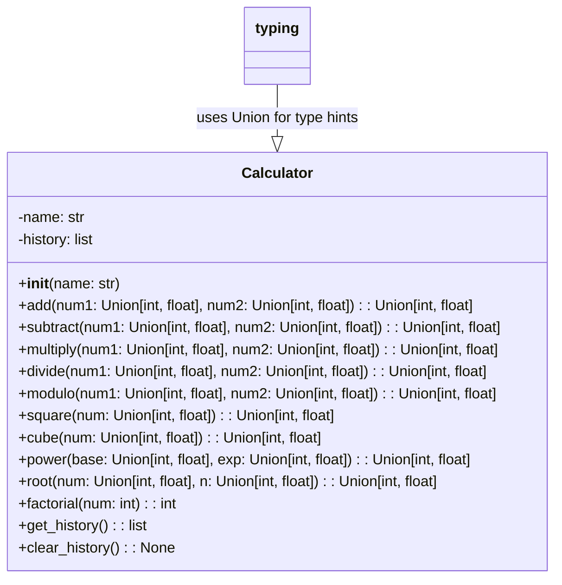
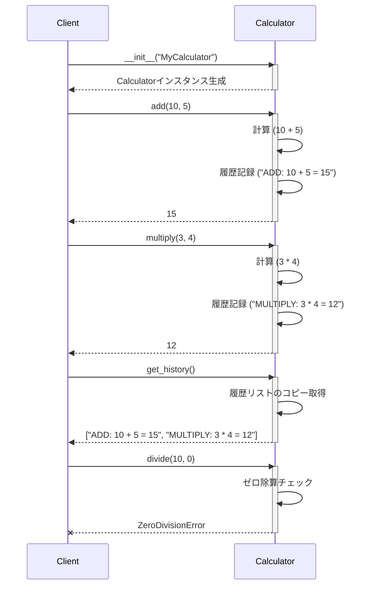

# test_sample 詳細設計書

## 1. 概要

### システム概要
本システムは、基本的な数値計算機能と、その計算履歴を管理する機能を提供する単一モジュールで構成された計算機システムです。ユーザーは様々な数値演算を実行し、過去の計算履歴を参照・クリアすることができます。

### 対象範囲（ファイル）
- 1個のモジュール（例: `calculator_module.py`）
- 主要クラス: `Calculator`

### 前提条件・制約事項
- 実行環境: Python 3.x
- 依存ライブラリ: Python標準ライブラリ（`typing`モジュールを含む）のみを使用します。
- 数値型: 整数（`int`）および浮動小数点数（`float`）に対応します。
- 履歴管理: 計算履歴はインスタンスのメモリ上に文字列形式で保持され、永続化機能は持ちません。

## 2. アーキテクチャ設計

### システム構成図
本システムは、`Calculator`クラスを中心とした単一モジュールで構成されます。`Calculator`クラスは、計算機能と履歴管理機能を集約しています。



### 処理フロー概要
1. **インスタンス生成**: クライアント（ユーザーまたは他のプログラム）は`Calculator`クラスのインスタンスを生成します。
2. **計算実行**: クライアントは生成された`Calculator`インスタンスのメソッドを呼び出し、各種計算を実行します。
3. **履歴記録**: 各計算メソッドは、計算内容と結果をインスタンス内部の履歴リスト（`self.history`）に文字列形式で自動的に記録します。
4. **履歴参照/クリア**: クライアントは`get_history()`メソッドで履歴を取得したり、`clear_history()`メソッドで履歴をクリアしたりすることができます。
5. **エラーハンドリング**: 不正な入力（例: ゼロ除算、負の数の階乗）に対しては、適切な例外を発生させます。

### 主要コンポーネント間の関係
- **`Calculator`クラス**: システムの中核であり、全ての計算ロジックと履歴管理ロジックをカプセル化します。
- **`typing`モジュール**: `Union`型ヒントを提供し、メソッドの引数と戻り値の型安全性を向上させます。これは実行時の依存性ではなく、コードの可読性と保守性を高めるためのものです。

### 関連するファイルや処理・呼び出されるメソッド・呼び出し元のメソッド
- **ファイル**: `calculator_module.py` (仮称)
- **処理**:
    - クライアントコード: `Calculator`インスタンスを生成し、そのパブリックメソッドを呼び出します。
    - `Calculator`クラスの各計算メソッド: 内部で`self.history`属性を更新します。
    - `get_history()`: `self.history`のコピーを返します。
    - `clear_history()`: `self.history`をクリアします。

## 3. クラス・メソッド設計

### 3.1 クラス・メソッド一覧表

| クラス名 | 役割 | 主要メソッド | 備考 |
| -------- | ---- | ------------ | ---- |
| `Calculator` | 数値計算機能と計算履歴管理機能を提供 | `__init__`, `add`, `subtract`, `multiply`, `divide`, `modulo`, `square`, `cube`, `power`, `root`, `factorial`, `get_history`, `clear_history` | 計算履歴を`self.history`に記録。エラーハンドリングを含む。 |

### 3.2 クラス・メソッド詳細仕様

#### クラス: `Calculator`

- **クラス概要**:
  数値計算機能（四則演算、べき乗、平方根、階乗など）を提供し、実行された全ての計算とその結果を内部的に履歴として管理するクラスです。計算履歴はインスタンスの生存期間中のみ保持されます。

- **属性一覧**:

| 属性名 | 型 | 初期値 | 説明 |
| ------ | -- | ------ | ---- |
| `name` | `str` | 引数で指定 | 計算機の識別名。 |
| `history` | `list[str]` | `[]` (空リスト) | 実行された計算の履歴を文字列形式で格納するリスト。 |

- **メソッド仕様**:

  - **`__init__(self, name: str)`**
    - **引数**:
      - `name` (`str`): 計算機の名前。
    - **戻り値**: なし
    - **処理概要**:
      - `Calculator`インスタンスを初期化します。
      - `self.name`を引数`name`で設定します。
      - `self.history`を空のリストで初期化します。
    - **例外**: なし

  - **`add(self, num1: Union[int, float], num2: Union[int, float]) -> Union[int, float]`**
    - **引数**:
      - `num1` (`Union[int, float]`): 加算される1つ目の数値。
      - `num2` (`Union[int, float]`): 加算される2つ目の数値。
    - **戻り値**: `Union[int, float]` - 加算結果。
    - **処理概要**:
      - `num1`と`num2`を加算します。
      - 計算内容と結果を文字列形式で`self.history`に記録します（例: "ADD: 1 + 2 = 3"）。
    - **例外**: なし

  - **`subtract(self, num1: Union[int, float], num2: Union[int, float]) -> Union[int, float]`**
    - **引数**:
      - `num1` (`Union[int, float]`): 減算される数値。
      - `num2` (`Union[int, float]`): 減算する数値。
    - **戻り値**: `Union[int, float]` - 減算結果。
    - **処理概要**:
      - `num1`から`num2`を減算します。
      - 計算内容と結果を文字列形式で`self.history`に記録します（例: "SUBTRACT: 5 - 2 = 3"）。
    - **例外**: なし

  - **`multiply(self, num1: Union[int, float], num2: Union[int, float]) -> Union[int, float]`**
    - **引数**:
      - `num1` (`Union[int, float]`): 乗算される1つ目の数値。
      - `num2` (`Union[int, float]`): 乗算される2つ目の数値。
    - **戻り値**: `Union[int, float]` - 乗算結果。
    - **処理概要**:
      - `num1`と`num2`を乗算します。
      - 計算内容と結果を文字列形式で`self.history`に記録します（例: "MULTIPLY: 3 * 4 = 12"）。
    - **例外**: なし

  - **`divide(self, num1: Union[int, float], num2: Union[int, float]) -> Union[int, float]`**
    - **引数**:
      - `num1` (`Union[int, float]`): 被除数。
      - `num2` (`Union[int, float]`): 除数。
    - **戻り値**: `Union[int, float]` - 除算結果。
    - **処理概要**:
      - `num1`を`num2`で除算します。
      - `num2`が0の場合、`ZeroDivisionError`を発生させます。
      - 計算内容と結果を文字列形式で`self.history`に記録します（例: "DIVIDE: 10 / 2 = 5"）。
    - **例外**:
      - `ZeroDivisionError`: 除数`num2`が0の場合。

  - **`modulo(self, num1: Union[int, float], num2: Union[int, float]) -> Union[int, float]`**
    - **引数**:
      - `num1` (`Union[int, float]`): 被除数。
      - `num2` (`Union[int, float]`): 除数。
    - **戻り値**: `Union[int, float]` - 剰余。
    - **処理概要**:
      - `num1`を`num2`で除算した剰余を計算します。
      - `num2`が0の場合、`ZeroDivisionError`を発生させます。
      - 計算内容と結果を文字列形式で`self.history`に記録します（例: "MODULO: 10 % 3 = 1"）。
    - **例外**:
      - `ZeroDivisionError`: 除数`num2`が0の場合。

  - **`square(self, num: Union[int, float]) -> Union[int, float]`**
    - **引数**:
      - `num` (`Union[int, float]`): 二乗する数値。
    - **戻り値**: `Union[int, float]` - 二乗結果。
    - **処理概要**:
      - `num`の二乗を計算します。
      - 計算内容と結果を文字列形式で`self.history`に記録します（例: "SQUARE: 5^2 = 25"）。
    - **例外**: なし

  - **`cube(self, num: Union[int, float]) -> Union[int, float]`**
    - **引数**:
      - `num` (`Union[int, float]`): 三乗する数値。
    - **戻り値**: `Union[int, float]` - 三乗結果。
    - **処理概要**:
      - `num`の三乗を計算します。
      - 計算内容と結果を文字列形式で`self.history`に記録します（例: "CUBE: 2^3 = 8"）。
    - **例外**: なし

  - **`power(self, base: Union[int, float], exp: Union[int, float]) -> Union[int, float]`**
    - **引数**:
      - `base` (`Union[int, float]`): 底。
      - `exp` (`Union[int, float]`): 指数。
    - **戻り値**: `Union[int, float]` - べき乗結果。
    - **処理概要**:
      - `base`の`exp`乗を計算します。
      - 計算内容と結果を文字列形式で`self.history`に記録します（例: "POWER: 2^10 = 1024"）。
    - **例外**: なし

  - **`root(self, num: Union[int, float], n: Union[int, float]) -> Union[int, float]`**
    - **引数**:
      - `num` (`Union[int, float]`): n乗根を計算する数値。
      - `n` (`Union[int, float]`): 根の次数。
    - **戻り値**: `Union[int, float]` - n乗根結果。
    - **処理概要**:
      - `num`の`n`乗根を計算します。
      - `num`が負の数で、かつ`n`が偶数の場合、`ValueError`を発生させます。
      - 計算内容と結果を文字列形式で`self.history`に記録します（例: "ROOT: 8^(1/3) = 2"）。
    - **例外**:
      - `ValueError`: `num`が負の数で、かつ`n`が偶数の場合。

  - **`factorial(self, num: int) -> int`**
    - **引数**:
      - `num` (`int`): 階乗を計算する非負の整数。
    - **戻り値**: `int` - 階乗結果。
    - **処理概要**:
      - `num`の階乗を計算します。
      - `num`が負の数の場合、`ValueError`を発生させます。
      - 計算内容と結果を文字列形式で`self.history`に記録します（例: "FACTORIAL: 5! = 120"）。
    - **例外**:
      - `ValueError`: `num`が負の数の場合。

  - **`get_history(self) -> list[str]`**
    - **引数**: なし
    - **戻り値**: `list[str]` - 計算履歴のリスト（コピー）。
    - **処理概要**:
      - `self.history`のシャローコピーを返します。これにより、呼び出し元が返されたリストを変更しても、内部の履歴が影響を受けないように保護します。
    - **例外**: なし
    - **保守性・拡張性**: 内部状態の保護により、予期せぬ履歴変更を防ぎ、堅牢性を高めます。

  - **`clear_history(self) -> None`**
    - **引数**: なし
    - **戻り値**: なし
    - **処理概要**:
      - `self.history`リストの内容を全てクリアします。
    - **例外**: なし
    - **保守性・拡張性**: 履歴の管理を`Calculator`クラス内部に閉じ込めることで、履歴の保存方法（例: ファイル、データベース）を変更する際も、このメソッドの内部実装のみを変更すればよく、外部への影響を最小限に抑えられます。

- **継承・実装関係**:
  - 継承: なし（基底クラス）
  - 実装: なし

## 4. インターフェース設計

### API 仕様
本システムのAPIは、`Calculator`クラスのパブリックメソッド群によって提供されます。

- **クラスインスタンス生成**:
  - `calculator_instance = Calculator(name="MyCalc")`

- **計算メソッド**:
  - `result = calculator_instance.add(num1, num2)`
  - `result = calculator_instance.subtract(num1, num2)`
  - `result = calculator_instance.multiply(num1, num2)`
  - `result = calculator_instance.divide(num1, num2)`
  - `result = calculator_instance.modulo(num1, num2)`
  - `result = calculator_instance.square(num)`
  - `result = calculator_instance.cube(num)`
  - `result = calculator_instance.power(base, exp)`
  - `result = calculator_instance.root(num, n)`
  - `result = calculator_instance.factorial(num)`

- **履歴管理メソッド**:
  - `history_list = calculator_instance.get_history()`
  - `calculator_instance.clear_history()`

### 入出力データ形式
- **入力**:
  - 数値引数: `int` または `float`
  - 計算機名: `str`
- **出力**:
  - 計算結果: `int` または `float`
  - 履歴リスト: `list[str]` (各要素は計算内容と結果を表す文字列)
  - `clear_history()`: なし

### エラーレスポンス仕様
各メソッドは、不正な入力や実行時エラーが発生した場合にPythonの標準例外を発生させます。

- **`ZeroDivisionError`**:
  - 発生条件: `divide()`または`modulo()`メソッドで除数に0が指定された場合。
  - 例外メッセージ: Python標準のメッセージ（例: "division by zero"）。
- **`ValueError`**:
  - 発生条件:
    - `root()`メソッドで負の数の偶数乗根を計算しようとした場合。
    - `factorial()`メソッドで負の整数が指定された場合。
  - 例外メッセージ: 各エラー条件に応じた具体的なメッセージ（例: "Cannot calculate even root of a negative number.", "Factorial is not defined for negative numbers."）。

## 5. データ設計

### データ構造
本システムで管理される主要なデータは、`Calculator`インスタンスが保持する計算履歴です。

- **`self.history`**:
  - **型**: `list[str]`
  - **構造**: 各要素は、実行された計算の内容と結果を記述した文字列です。
  - **例**:
    ```
    [
        "ADD: 10 + 5 = 15",
        "MULTIPLY: 3 * 4 = 12",
        "SQUARE: 7^2 = 49"
    ]
    ```
  - **備考**: このデータはメモリ上にのみ存在し、アプリケーション終了時には失われます。永続化は行いません。

### データベーステーブル設計
該当しません。本システムはデータベースを使用しません。

### データフロー図
`Calculator`インスタンス内部での計算結果と履歴データの流れを示します。

```mermaid
flowchart TD
    A[入力数値 (num1, num2, etc.)] --> B{Calculator メソッド呼び出し};
    B --> C[計算ロジック];
    C --> D[計算結果];
    D --> E[履歴文字列生成];
    E --> F[self.history (リスト) に追加];
    F -- 履歴取得要求 --> G[get_history()];
    G --> H[self.history のコピー];
    H --> I[出力履歴リスト];
    F -- 履歴クリア要求 --> J[clear_history()];
    J --> F;
```

## 6. 処理設計

### 6.1 主要処理フロー

#### シーケンス図での表現
クライアントが`Calculator`インスタンスを生成し、計算を実行し、履歴を取得する一連の流れを示します。



#### 処理ステップの詳細説明

1.  **`Calculator`インスタンスの初期化 (`__init__`)**:
    -   クライアントからの`Calculator("MyCalculator")`のような呼び出しにより、新しい`Calculator`オブジェクトが生成されます。
    -   オブジェクトの`name`属性が指定された名前に設定され、`history`属性は空のリスト`[]`として初期化されます。

2.  **計算メソッドの実行 (例: `add`, `divide`, `square`など)**:
    -   クライアントが`calculator_instance.add(10, 5)`のように計算メソッドを呼び出します。
    -   **入力検証**: 必要に応じて、引数の型や値の妥当性をチェックします（例: `divide`でのゼロ除算、`root`での負の数の偶数乗根、`factorial`での負の数）。不正な場合は適切な例外（`ZeroDivisionError`, `ValueError`）を発生させ、処理を中断します。
    -   **計算実行**: 渡された引数に基づいて、対応する数値計算を実行します。
    -   **履歴記録**: 計算内容（例: "ADD: 10 + 5"）と計算結果（例: "= 15"）を結合した文字列を生成し、`self.history`リストの末尾に追加します。これにより、全ての計算が追跡可能になります。
    -   **結果返却**: 計算結果をクライアントに返します。

3.  **履歴の取得 (`get_history`)**:
    -   クライアントが`calculator_instance.get_history()`を呼び出します。
    -   `self.history.copy()`を使用して、内部の履歴リストのシャローコピーを作成します。
    -   作成したコピーをクライアントに返します。これにより、クライアントが返されたリストを変更しても、`Calculator`インスタンスの内部状態が保護されます。

4.  **履歴のクリア (`clear_history`)**:
    -   クライアントが`calculator_instance.clear_history()`を呼び出します。
    -   `self.history.clear()`を呼び出し、`self.history`リスト内の全ての要素を削除します。
    -   戻り値はありません。

**保守性・拡張性の観点**:
-   **単一責任の原則**: `Calculator`クラスは計算と履歴管理という明確な責任を持ちます。これにより、機能追加や変更が容易になります。
-   **カプセル化**: `self.history`属性はクラス内部にカプセル化されており、`get_history()`でコピーを返すことで、外部からの意図しない変更を防ぎます。履歴の保存方法を変更する場合（例: ファイルへの永続化、データベース利用）、`Calculator`クラスの内部実装のみを変更すればよく、外部インターフェースに影響を与えません。
-   **エラーハンドリング**: ゼロ除算や不正な入力に対する例外処理が組み込まれており、システムの堅牢性が向上しています。新しい計算機能を追加する際も、同様のエラーハンドリングパターンを適用することで一貫性を保てます。
-   **型ヒント**: `typing.Union`などの型ヒントを積極的に利用することで、コードの可読性が向上し、開発者がメソッドの引数や戻り値の型を容易に理解できるようになります。これは大規模な開発やチーム開発において特に保守性を高めます。
-   **機能拡張**: 新しい計算機能を追加する場合、`Calculator`クラスに新しいメソッドを追加するだけで対応可能です。既存のコードへの影響は最小限に抑えられます。